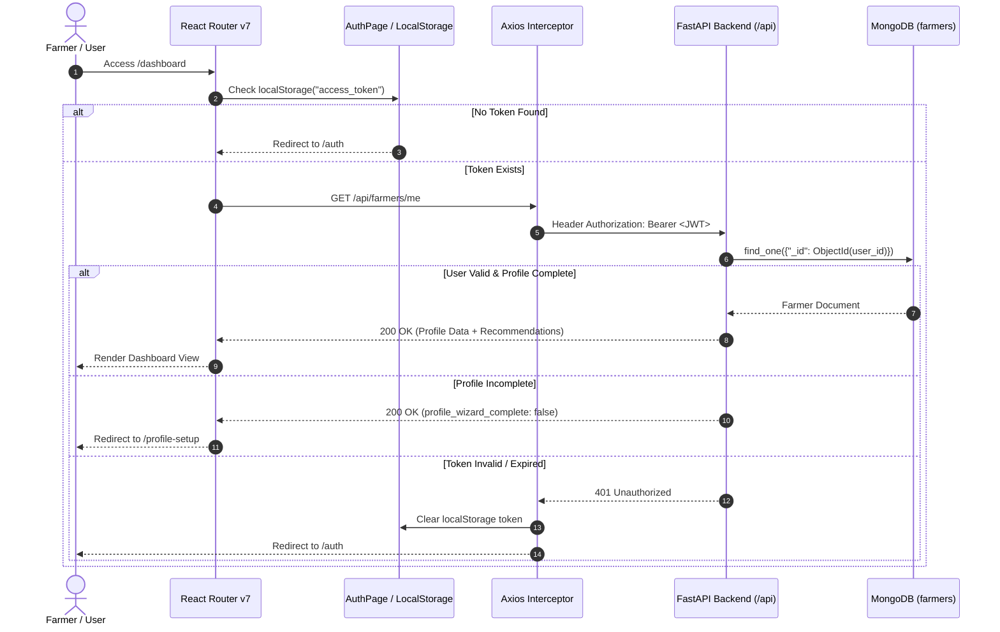
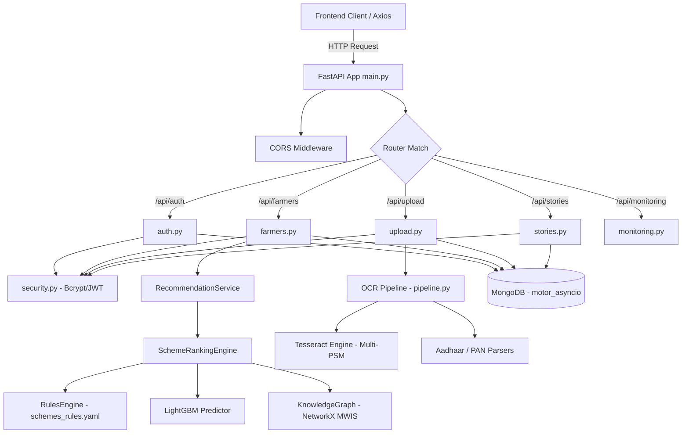
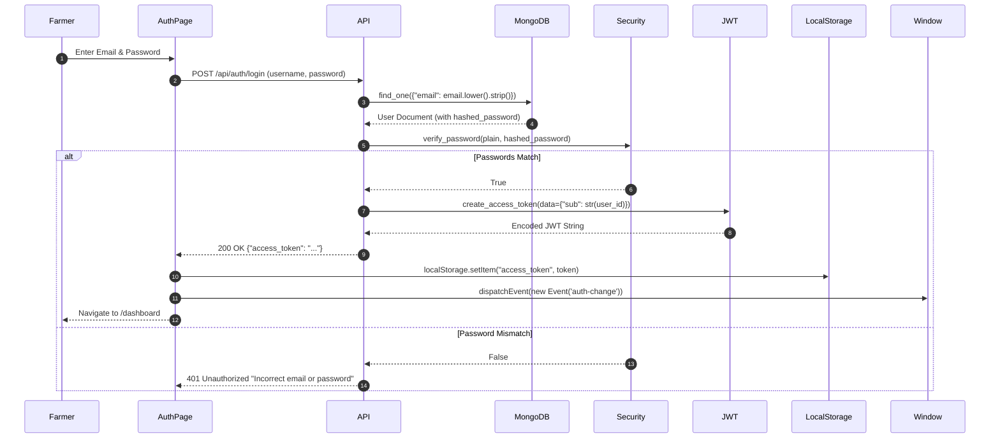
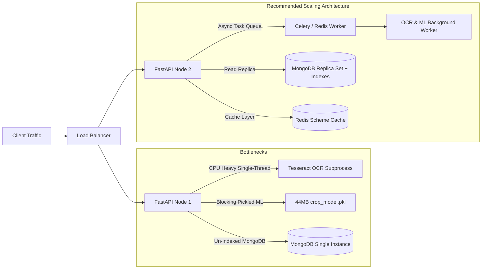
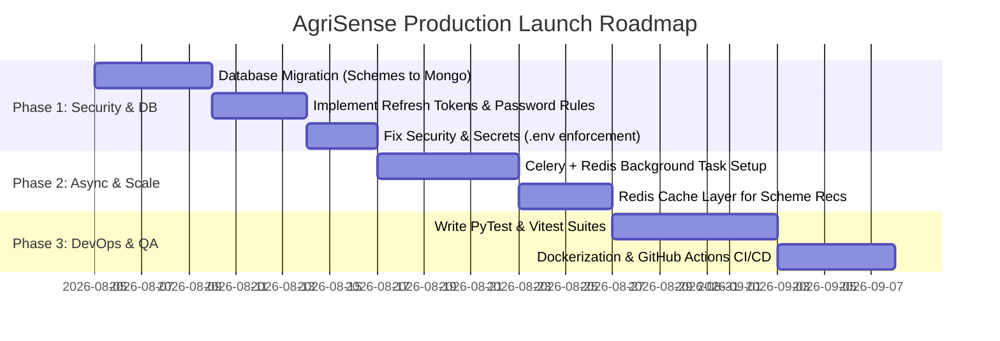

# AgriSense (IPD Project) — Comprehensive Technical Analysis Report

**Prepared by:** Senior Software Architect, Lead Backend/Frontend Engineer & DevOps Specialist  
**Target Repository:** `IPD_Project/ipd`  
**Date of Analysis:** August 2026  
**Document Status:** Final Production Audit & System Architecture Documentation

---

## Executive Summary

**AgriSense** is an AI-driven, web-based intelligent scheme discovery and agricultural decision-support platform engineered for Indian farmers. The platform aims to bridge the information gap between small/medium-scale farmers and government welfare programs by leveraging automated Document OCR (Aadhaar/PAN verification), Machine Learning-driven Crop Recommendation, LightGBM-powered Scheme Approval Probability Prediction, Graph Theory-based Scheme Bundling (Maximum Weight Independent Set), and a Community Success Hub.

This technical report presents a comprehensive, zero-assumption audit of the complete codebase repository across all application tiers.

---

# Phase 1: Repository Structure Analysis

## Project Structure

```
c:\Users\gmore\OneDrive\Desktop\IPD_Project\ipd\
├── backend/                                  # FastAPI Python Backend Service
│   ├── app/                                  # Core Application Package
│   │   ├── api/                              # REST API Route Controllers
│   │   │   ├── __init__.py                   # Package initializer
│   │   │   ├── auth.py                       # Authentication endpoints (Signup / Login)
│   │   │   ├── documents.py                  # Legacy document verification route
│   │   │   ├── farmers.py                    # Farmer profile, recommendations & crop AI routes
│   │   │   ├── monitoring.py                 # Health checks, scrapers & policy testing routes
│   │   │   ├── stories.py                    # Community stories & upvoting endpoints
│   │   │   └── upload.py                     # Document upload & OCR processing endpoint
│   │   ├── core/                             # System Configuration & Core Utilities
│   │   │   ├── config.py                     # Environment variables & Settings singleton
│   │   │   ├── database.py                   # Async MongoDB client setup (Motor)
│   │   │   └── security.py                   # Bcrypt hashing & JWT token verification
│   │   ├── ml/                               # Machine Learning & AI Engineering Subsystem
│   │   │   ├── datasets/                     # Raw & preprocessed CSV training datasets
│   │   │   │   ├── crop_recommendation_dataset.csv
│   │   │   │   └── scheme_success_dataset.csv
│   │   │   ├── explainability/               # AI Explainability module
│   │   │   │   └── scheme_explainer.py       # Human-readable rule explanation generator
│   │   │   ├── features/                     # Feature store & transformation
│   │   │   │   ├── feature_definitions.py
│   │   │   │   └── feature_store.py          # Profile cleaner & feature engineer
│   │   │   ├── graph/                        # Knowledge Graph & Optimizations
│   │   │   │   └── knowledge_graph.py        # NetworkX conflict graph & MWIS bundler
│   │   │   ├── inference/                    # Model Inference Handlers
│   │   │   │   ├── benefit_predictor.py      # Dynamic financial benefit calculator
│   │   │   │   ├── crop_recommender.py       # RandomForest crop recommendation wrapper
│   │   │   │   ├── document_classifier.py    # PyTorch document type classifier wrapper
│   │   │   │   ├── ranking_engine.py         # Master scheme recommendation pipeline
│   │   │   │   └── success_predictor.py      # LightGBM approval probability predictor
│   │   │   ├── models/                       # Serialized Pre-trained Model Binaries
│   │   │   │   ├── crop_model.pkl            # RandomForest model (44.1 MB)
│   │   │   │   ├── document_classifier.pt    # PyTorch model (497 KB)
│   │   │   │   ├── registry.py               # Model registry & singleton loader
│   │   │   │   └── scheme_success_model.pkl  # LightGBM model (1.06 MB)
│   │   │   ├── ocr/                          # Optical Character Recognition Subsystem
│   │   │   │   ├── __init__.py
│   │   │   │   ├── classification.py         # Keyword-based document classifier
│   │   │   │   ├── config.py                 # Cross-platform Tesseract path detector
│   │   │   │   ├── document_parser.py        # PDF text extractor utility
│   │   │   │   ├── document_pipeline.py      # Legacy document processing wrapper
│   │   │   │   ├── document_verifier.py      # Legacy document verification logic
│   │   │   │   ├── mapping.py                # OCR field to Farmer profile mapper
│   │   │   │   ├── ocr_engine.py             # Legacy OCR engine (Windows fixed path)
│   │   │   │   ├── ocr_engine_v2.py          # Updated OCR engine
│   │   │   │   ├── ocr_service.py            # Primary Tesseract wrapper (Multi-PSM)
│   │   │   │   ├── parsers.py                # Regex & Heuristic Parsers (Aadhaar & PAN)
│   │   │   │   ├── pipeline.py               # Main OCR pipeline orchestrator
│   │   │   │   ├── preprocessing.py          # OpenCV image processing (Grayscale, Threshold)
│   │   │   │   ├── test_ocr.py               # Diagnostic script snippet
│   │   │   │   ├── test_parser.py            # Parser test snippet
│   │   │   │   ├── utils.py                  # Image helper functions
│   │   │   │   └── validation.py             # Verhoeff & PAN regex validators
│   │   │   ├── policy_engine/                # NLP Policy Ingestion Subsystem
│   │   │   │   └── policy_ingestor.py        # Rule extractor from raw policy text
│   │   │   ├── preprocessing/                # Data cleaning utilities
│   │   │   │   ├── data_cleaning.py
│   │   │   │   ├── encoders.py
│   │   │   │   └── feature_engineering.py
│   │   │   ├── reinforcement/                # Reinforcement Learning (Bandit) Module
│   │   │   │   ├── interaction_logger.py     # User feedback logger
│   │   │   │   └── policy_engine.py          # Epsilon-greedy scheme selector
│   │   │   ├── rules/                        # Rule Engine Data & Code
│   │   │   │   ├── rules_engine.py           # AST-based eligibility evaluator
│   │   │   │   └── schemes_rules.yaml        # Source-of-truth declarative scheme rules
│   │   │   ├── services/                     # ML High-Level Services
│   │   │   │   ├── __init__.py
│   │   │   │   └── recommendation_service.py # Singleton wrapper for RankingEngine
│   │   │   └── utils/                        # ML Shared Helpers
│   │   │       ├── logger.py                 # Logging utility
│   │   │       ├── model_loader.py           # Joblib pickle loader
│   │   │       └── profile_mapper.py         # Profile-to-ML feature map adapter
│   │   ├── models/                           # Pydantic Schemas & Data Contracts
│   │   │   ├── __init__.py
│   │   │   ├── farmer.py                     # FarmerProfile, Signup, Token, Alerts Pydantic models
│   │   │   ├── scheme.py                     # Scheme & EligibilityCriteria models
│   │   │   └── story.py                      # Community Story Pydantic models
│   │   ├── services/                         # Core Backend Application Services
│   │   │   ├── predictive_alert_service.py   # Heuristic weather & pest risk generator
│   │   │   └── scheme_monitor.py             # Proactive government portal scraper
│   │   └── main.py                           # FastAPI Entrypoint & Middleware Configuration
│   ├── scripts/                              # Verification & Utility Scripts
│   │   └── verify_ocr.py                     # End-to-end OCR test script
│   ├── uploads/                              # Storage for user-uploaded ID documents
│   ├── .env                                  # Environment variables file
│   ├── error.log                             # Application log file
│   ├── requirements.txt                      # Python dependencies manifest
│   ├── test_auth.sh                          # Shell script for Auth API testing
│   ├── test_auth_api.py                      # Python test for Auth endpoints
│   ├── test_db.py                            # PyMongo connection test script
│   ├── test_db2.py                           # Motor async connection test script
│   ├── test_jwt.py                           # JWT encoding/decoding test script
│   └── test_response.py                      # Response schema test script
│
├── frontend/                                 # Vite + React 19 Frontend Application
│   ├── public/                               # Static public assets
│   ├── src/                                  # Source Code Root
│   │   ├── assets/                           # Images and SVGs
│   │   ├── components/                       # Shared React Components
│   │   │   ├── ui/                           # Shadcn UI primitives (Button, Card, Dialog, etc.)
│   │   │   ├── CreateStoryModal.tsx          # Modal dialog to post community stories
│   │   │   ├── CropShowcase.tsx              # Dynamic crop showcase visual component
│   │   │   ├── DarkVeil.tsx                  # Animated particle/gradient background canvas
│   │   │   ├── LanguageSwitcher.tsx          # i18n language selector dropdown
│   │   │   ├── Navbar.tsx                    # Top navigation bar with theme & auth state
│   │   │   ├── ProtectedRoute.tsx            # Route guard for auth & profile wizard completion
│   │   │   └── theme-provider.tsx            # Next-themes dark/light mode context
│   │   ├── hooks/                            # Custom React Hooks
│   │   │   ├── useTranslationText.ts         # Hook wrapper for i18next translation
│   │   │   └── useVoiceInput.ts              # Web Speech API speech-to-text hook
│   │   ├── i18n/                             # Internationalization
│   │   │   ├── i18n.ts                       # i18next initialization & config
│   │   │   └── locales/                      # Translation JSON files (English, Hindi, Marathi)
│   │   ├── lib/                              # Utility Libraries
│   │   │   ├── api.ts                        # Axios client instance with Bearer interceptor
│   │   │   └── utils.ts                      # Classname merging utility (`clsx` + `tailwind-merge`)
│   │   ├── pages/                            # Application Views (Pages)
│   │   │   ├── AuthPage.tsx                  # Login and Signup tabbed card page
│   │   │   ├── CommunityHub.tsx              # Farmer success stories feed & upvoting page
│   │   │   ├── Dashboard.tsx                 # Main farmer control center & AI recommendations page
│   │   │   ├── LandingPage.tsx               # Public landing page with features, process & FAQ
│   │   │   └── ProfileWizard.tsx             # 3-step farmer onboarding wizard (with OCR upload)
│   │   ├── App.css                           # App-level styling rules
│   │   ├── App.tsx                           # Master Router configuration & provider layout
│   │   ├── index.css                         # Tailwind CSS directives & custom root variables
│   │   └── main.jsx                          # React DOM entry point
│   ├── eslint.config.js                      # ESLint flat configuration
│   ├── index.html                            # HTML template entrypoint
│   ├── package.json                          # Node.js dependencies & scripts manifest
│   ├── postcss.config.js                     # PostCSS config (Tailwind & Autoprefixer)
│   ├── tailwind.config.js                    # Tailwind CSS design system tokens
│   ├── tsconfig.json                         # TypeScript configuration
│   └── vite.config.js                        # Vite bundler configuration
│
├── dump/                                     # Temporary backup dump directory
├── memory-bank/                              # Project documentation & architectural decisions
└── README_PROJECT_ANALYSIS.md                # THIS COMPREHENSIVE ARCHITECTURAL REPORT
```

---

## Detailed Directory & File Explanations

### Frontend Directory (`frontend/`)
* **`src/App.tsx`**: Sets up `BrowserRouter`, global `ThemeProvider`, `Toaster` (Sonner), `Navbar`, and defines public routes (`/`, `/auth`, `/community`) and protected routes (`/profile-setup`, `/dashboard`).
* **`src/lib/api.ts`**: Configures Axios instance (`http://127.0.0.1:8000/api`). Attaches `Authorization: Bearer <token>` interceptor from `localStorage`. Handles global `401 Unauthorized` responses by clearing local storage and redirecting users to `/auth`.
* **`src/components/ProtectedRoute.tsx`**: Route guard component that verifies authentication via `GET /api/farmers/me`. Checks `profile_wizard_complete` status. Redirects unauthenticated users to `/auth` and incomplete profiles to `/profile-setup`.
* **`src/components/Navbar.tsx`**: Fixed top glassmorphism navigation header. Listens for window `storage` and custom `auth-change` events to update UI dynamically without requiring full page refreshes.
* **`src/pages/LandingPage.tsx`**: High-conversion landing view presenting AgriSense features, 3D/particle visual effects (`DarkVeil`), success stories preview, process breakdown, and multi-lingual toggle.
* **`src/pages/AuthPage.tsx`**: Unified sign-in/sign-up page. Handles form submission, calls `/api/auth/signup` and `/api/auth/login`, persists JWT in `localStorage`, and triggers auto-navigation.
* **`src/pages/ProfileWizard.tsx`**: Step-by-step onboarding flow. Step 1: Personal & Location Details; Step 2: Document Upload & Real-time OCR Auto-fill; Step 3: Farming & Crop Details. Updates farmer profile via `PUT /api/farmers/me`.
* **`src/pages/Dashboard.tsx`**: Main operational hub for farmers. Displays profile summary, AI-recommended eligible schemes, ineligible schemes with rejection reasons, optimal scheme bundles, predictive weather/pest alerts, and an interactive crop recommendation model predictor.
* **`src/pages/CommunityHub.tsx`**: Social proof feed where verified farmers share success stories. Supports filtering by crop, state, and scheme ID, as well as real-time upvoting.

### Backend Directory (`backend/`)
* **`app/main.py`**: The FastAPI application entrypoint. Configures lifespan events (connecting/disconnecting MongoDB), registers CORS middleware with local Vite ports (`5173-5175`), and mounts API routers (`/api/auth`, `/api/farmers`, `/api/upload`, `/api/stories`, `/documents`, `/api/monitoring`).
* **`app/core/config.py`**: Reads `.env` variables via `python-dotenv`. Stores settings for `MONGO_URI`, `DATABASE_NAME`, `SECRET_KEY`, `ALGORITHM` (HS256), and `ACCESS_TOKEN_EXPIRE_MINUTES` (1440 mins).
* **`app/core/database.py`**: Implements asynchronous MongoDB database connection management using `motor.motor_asyncio.AsyncIOMotorClient` with a 5000ms server selection timeout guard.
* **`app/core/security.py`**: Authentication helper module. Implements bcrypt password hashing (`get_password_hash`, `verify_password`), PyJWT token generation (`create_access_token`), and FastAPI `OAuth2PasswordBearer` current user dependency (`get_current_user`).

### ML Directory (`backend/app/ml/`)
* **`inference/ranking_engine.py`**: Orchestrates the multi-stage recommendation pipeline:
  1. Profile cleaning via `FeatureStore`
  2. Rule-based filtering via `RulesEngine` (`schemes_rules.yaml`)
  3. Feature translation via `profile_mapper`
  4. LightGBM approval probability scoring via `SchemeSuccessPredictor`
  5. Dynamic financial valuation via `BenefitPredictor`
  6. Maximum Weight Independent Set (MWIS) conflict-free bundling via `SchemeKnowledgeGraph`
  7. Reinforcement learning selection via `SchemePolicy`
* **`inference/crop_recommender.py`**: Wraps pre-trained `crop_model.pkl` (RandomForestClassifier). Accepts NPK, rainfall, temperature, soil type, season, and irrigation type to output optimal crop predictions.
* **`rules/schemes_rules.yaml`**: The single source of truth for 10 government scheme definitions, criteria rules, financial calculation types, and conflict lists.

### OCR Directory (`backend/app/ml/ocr/`)
* **`ocr_service.py`**: Core Tesseract execution service. Utilizes a multi-PSM strategy (PSM 6, PSM 11, PSM 3) to execute Tesseract on images/PDFs and select the extraction result yielding maximum confidence and characters.
* **`parsers.py`**: Contains `AadhaarParser` (extracts Aadhaar Number, DOB, Gender, Name) and `PANParser` (extracts PAN, DOB, Name, Father's Name using 4 fallback regex strategies and positional character correction for `0/O` and `1/I` confusions).
* **`pipeline.py`**: Main OCR workflow orchestrator executing File Validation → Tesseract Extraction → Keyword Classification → Regex Field Parsing → Validation → Profile Mapping.

---

# Phase 2: Frontend Analysis

## Frontend Architecture



### Technical Specifications
* **Framework**: React 19 (`react` 19.2.0, `react-dom` 19.2.0) bundled via Vite 7 (`vite` 7.3.1) with TypeScript.
* **Routing Structure**: React Router v7 (`react-router-dom` 7.13.1).
* **Styling**: Tailwind CSS v3 (`tailwindcss` 3.4.17), Radix UI primitives (`@radix-ui/*`), Shadcn UI, Framer Motion (`framer-motion` 12.35.2), and Lucide Icons (`lucide-react`).
* **State Management**: React local state (`useState`, `useContext`), `localStorage` for JWT tokens, and global custom events (`window.dispatchEvent(new Event('auth-change'))`).
* **API Calls**: Custom Axios instance (`lib/api.ts`) with request/response interceptors.
* **Internationalization**: `i18next` with `react-i18next` supporting English (`en`), Hindi (`hi`), and Marathi (`mr`).

---

## Page-by-Page Architectural Breakdown

### 1. Landing Page (`src/pages/LandingPage.tsx`)
* **File Path**: `frontend/src/pages/LandingPage.tsx`
* **Purpose**: Public showcase page for platform capabilities, process overview, top success stories, and FAQ.
* **APIs Used**: `GET /api/stories/top?limit=3`
* **Inputs**: User scroll, language toggle, navigation clicks.
* **Outputs**: Interactive landing page, CTA navigation to `/auth` or `/dashboard`.
* **Dependencies**: `framer-motion`, `DarkVeil.tsx`, `CropShowcase.tsx`, `LanguageSwitcher.tsx`.

### 2. Auth Page (`src/pages/AuthPage.tsx`)
* **File Path**: `frontend/src/pages/AuthPage.tsx`
* **Purpose**: User registration and login card interface.
* **APIs Used**: `POST /api/auth/signup`, `POST /api/auth/login`
* **Inputs**: `full_name`, `email`, `password`.
* **Outputs**: JSON containing `access_token`, saves token to `localStorage`, navigates to `/dashboard`.
* **Dependencies**: `sonner`, `lib/api.ts`, `lucide-react`.

### 3. Profile Wizard (`src/pages/ProfileWizard.tsx`)
* **File Path**: `frontend/src/pages/ProfileWizard.tsx`
* **Purpose**: 3-step farmer onboarding wizard. Handles personal info, document upload with real-time OCR auto-fill, and agricultural profile setup.
* **APIs Used**: `POST /api/upload`, `PUT /api/farmers/me`
* **Inputs**: Form fields (State, District, Land Size, Crops, Soil) & Document File upload (`.jpg`, `.png`, `.pdf`).
* **Outputs**: Extracted OCR fields, updated farmer profile in DB, sets `profile_wizard_complete: true`.
* **Dependencies**: `lib/api.ts`, `useVoiceInput.ts`, `sonner`.

### 4. Dashboard (`src/pages/Dashboard.tsx`)
* **File Path**: `frontend/src/pages/Dashboard.tsx`
* **Purpose**: Main control center displaying personalized recommendations, predictive risk alerts, optimal scheme bundles, and ML crop predictor.
* **APIs Used**: `GET /api/farmers/me`, `POST /api/farmers/recommend-crop`, `GET /api/monitoring/schemes/latest`
* **Inputs**: Soil/Season selections for crop recommendation.
* **Outputs**: Scheme recommendations array, bundle recommendations, predictive alerts, recommended crop string.
* **Dependencies**: `lib/api.ts`, `lucide-react`, `sonner`.

### 5. Community Hub (`src/pages/CommunityHub.tsx`)
* **File Path**: `frontend/src/pages/CommunityHub.tsx`
* **Purpose**: Social network feed for farmers to share stories and view community experiences.
* **APIs Used**: `GET /api/stories/`, `POST /api/stories/`, `POST /api/stories/{id}/upvote`
* **Inputs**: Story text, crop filter, state filter, upvote button trigger.
* **Outputs**: Rendered stories feed, upvote counts update.
* **Dependencies**: `CreateStoryModal.tsx`, `lib/api.ts`, `sonner`.

---

# Phase 3: Backend Analysis

## Backend Architecture

The backend is constructed with **FastAPI** (Python 3.10+) utilizing asynchronous `async/await` syntax and Pydantic v2 data models.



---

## Detailed API Endpoint Specifications

### 1. Signup Endpoint
* **Route**: `/api/auth/signup`
* **Method**: `POST`
* **Purpose**: Register a new farmer account.
* **Input**: `FarmerSignup` JSON (`full_name`, `email`, `password`).
* **Output**: `FarmerResponse` JSON.
* **Authentication Required**: No.
* **Files Involved**: `app/api/auth.py`, `app/core/security.py`, `app/models/farmer.py`.
* **Internal Functions Called**: `get_db()`, `db["farmers"].find_one()`, `get_password_hash()`, `db["farmers"].insert_one()`.
* **Example Request**:
  ```json
  {
    "full_name": "Ramesh Patel",
    "email": "ramesh@example.com",
    "password": "SecurePassword123!"
  }
  ```
* **Example Response**:
  ```json
  {
    "_id": "66ac89e1f123456789abcdef",
    "full_name": "Ramesh Patel",
    "email": "ramesh@example.com",
    "is_differently_abled": false,
    "bank_account_linked": false,
    "primary_crops": [],
    "documents_uploaded": [],
    "profile_wizard_complete": false
  }
  ```

### 2. Login Endpoint
* **Route**: `/api/auth/login`
* **Method**: `POST`
* **Purpose**: Authenticate farmer credentials and issue JWT bearer token.
* **Input**: `OAuth2PasswordRequestForm` (`username` = email, `password` = password).
* **Output**: `Token` JSON (`access_token`, `token_type`: "bearer").
* **Authentication Required**: No.
* **Files Involved**: `app/api/auth.py`, `app/core/security.py`, `app/core/config.py`.
* **Internal Functions Called**: `verify_password()`, `create_access_token()`.
* **Example Request** (`application/x-www-form-urlencoded`):
  `username=ramesh@example.com&password=SecurePassword123!`
* **Example Response**:
  ```json
  {
    "access_token": "eyJhbGciOiJIUzI1NiIsInR5cCI6IkpXVCJ9...",
    "token_type": "bearer"
  }
  ```

### 3. Get Current Farmer Profile Endpoint
* **Route**: `/api/farmers/me`
* **Method**: `GET`
* **Purpose**: Fetch authenticated farmer profile along with dynamically calculated AI scheme recommendations, bundles, ineligible explanations, and predictive risk alerts.
* **Input**: None (JWT Bearer Token in Header).
* **Output**: `FarmerResponse` JSON.
* **Authentication Required**: Yes (`get_current_user`).
* **Files Involved**: `app/api/farmers.py`, `app/ml/services/recommendation_service.py`, `app/services/predictive_alert_service.py`.
* **Internal Functions Called**: `RecommendationService.get_recommendations()`, `PredictiveAlertService.generate_alerts()`.
* **Example Response**:
  ```json
  {
    "_id": "66ac89e1f123456789abcdef",
    "full_name": "Ramesh Patel",
    "email": "ramesh@example.com",
    "state": "Maharashtra",
    "land_size_hectares": 1.5,
    "recommended_schemes": [
      {
        "scheme_id": "PM_KISAN",
        "scheme_name": "PM Kisan Samman Nidhi",
        "success_probability": 0.89,
        "explanation": ["Land size is <= 2 Ha", "Income is within limits"],
        "predicted_financial_value": 6000,
        "benefit_type": "Direct Financial Transfer"
      }
    ],
    "recommended_bundles": [
      {
        "bundle_id": "BUNDLE-1",
        "total_benefit_value": 21000,
        "schemes": [...]
      }
    ],
    "predictive_alerts": [
      {
        "alert_type": "weather_risk",
        "severity": "medium",
        "message": "Monsoon irregularities detected in your region.",
        "recommended_action": "Ensure drainage systems are clear."
      }
    ]
  }
  ```

### 4. Crop Recommendation Endpoint
* **Route**: `/api/farmers/recommend-crop`
* **Method**: `POST`
* **Purpose**: Run ML model inference (`crop_model.pkl`) to predict the best crop based on soil and season inputs.
* **Input**: JSON payload (`soil_type`, `crop_season`, `irrigation_type`).
* **Output**: JSON (`recommended_crop`, `status`).
* **Authentication Required**: Yes (`get_current_user`).
* **Files Involved**: `app/api/farmers.py`, `app/ml/inference/crop_recommender.py`.
* **Internal Functions Called**: `CropRecommender.recommend_crop()`.
* **Example Request**:
  ```json
  {
    "soil_type": "Black",
    "crop_season": "Kharif",
    "irrigation_type": "Rainfed"
  }
  ```
* **Example Response**:
  ```json
  {
    "recommended_crop": "Cotton",
    "status": "success"
  }
  ```

### 5. Document Upload & OCR Endpoint
* **Route**: `/api/upload/`
* **Method**: `POST`
* **Purpose**: Accept uploaded ID document (Aadhaar or PAN), execute Tesseract OCR pipeline, parse fields, update DB record, and return profile auto-fill suggestions.
* **Input**: `multipart/form-data` (`file`: File, `doc_type`: Form string "aadhar" | "pan").
* **Output**: JSON with `documentType`, `confidence`, `fields`, `validation`, `profileSuggestions`.
* **Authentication Required**: Yes (`get_current_user`).
* **Files Involved**: `app/api/upload.py`, `app/ml/ocr/pipeline.py`, `app/ml/ocr/ocr_service.py`.
* **Internal Functions Called**: `run_ocr_pipeline()`, `db["farmers"].update_one()`.
* **Example Response**:
  ```json
  {
    "status": "success",
    "filename": "66ac89e1_pan_a1b2c3d4.jpg",
    "documentType": "PAN",
    "confidence": 92.4,
    "fields": {
      "panNumber": "ABCDE1234F",
      "name": "RAMESH PATEL",
      "dob": "15/08/1985"
    },
    "validation": {
      "valid": true,
      "warnings": []
    },
    "profileSuggestions": {
      "full_name_ocr_suggestion": "RAMESH PATEL",
      "pan_number": "ABCDE1234F"
    },
    "processingTimeMs": 420.5
  }
  ```

---

# Phase 4: API Audit

## API Inventory & Operational Status

| Endpoint | Method | File Path | Purpose | Operational Status | Data Source | Production Readiness |
| :--- | :--- | :--- | :--- | :--- | :--- | :--- |
| `GET /` | `GET` | `app/main.py` | System Root Health Check | **Working** | Hardcoded Message | Ready |
| `/api/auth/signup` | `POST` | `app/api/auth.py` | Farmer Account Registration | **Working** | MongoDB (`farmers`) | Ready |
| `/api/auth/login` | `POST` | `app/api/auth.py` | OAuth2 Password Login | **Working** | MongoDB (`farmers`) | Needs Refresh Tokens |
| `/api/farmers/me` | `GET` | `app/api/farmers.py` | Get Current Farmer Profile | **Working** | MongoDB + ML Engine | Ready |
| `/api/farmers/me` | `PUT` | `app/api/farmers.py` | Update Farmer Profile | **Working** | MongoDB (`farmers`) | Ready |
| `/api/farmers/recommend-crop` | `POST` | `app/api/farmers.py` | Predict Crop for Soil/Weather | **Working (Heuristic + ML)** | Heuristic Mapping → `crop_model.pkl` | Semi-Production (Mock NPK) |
| `/api/farmers/` | `POST` | `app/api/farmers.py` | Legacy Farmer Creation | **Working** | MongoDB (`farmers`) | Legacy |
| `/api/farmers/{id}` | `GET` | `app/api/farmers.py` | Get Farmer by ID | **Working** | MongoDB (`farmers`) | Ready |
| `/api/farmers/` | `GET` | `app/api/farmers.py` | Get All Farmers | **Working** | MongoDB (`farmers`) | Needs Pagination |
| `/api/upload/` | `POST` | `app/api/upload.py` | Upload & OCR ID Document | **Working** | Local Disk + Tesseract | Requires Tesseract OS binary |
| `/documents/verify` | `POST` | `app/api/documents.py` | Legacy Document Verification | **Working** | Redirects to `upload.py` | Deprecated |
| `/api/stories/` | `POST` | `app/api/stories.py` | Post Community Success Story | **Working** | MongoDB (`stories`) | Ready |
| `/api/stories/` | `GET` | `app/api/stories.py` | Query Stories with Filters | **Working** | MongoDB (`stories`) | Ready |
| `/api/stories/top` | `GET` | `app/api/stories.py` | Get Top Stories for Landing | **Working** | MongoDB (`stories`) | Ready |
| `/api/stories/{id}` | `GET` | `app/api/stories.py` | Get Story Details | **Working** | MongoDB (`stories`) | Ready |
| `/api/stories/{id}/upvote`| `POST` | `app/api/stories.py` | Upvote / Unvote Story | **Working** | MongoDB (`stories`) | Ready |
| `/api/monitoring/ocr-health` | `GET` | `app/api/monitoring.py` | Diagnostic for Tesseract OCR | **Working** | OS Subprocess / Config | Ready |
| `/api/monitoring/system-status` | `GET` | `app/api/monitoring.py` | Check Portal Scraper Status | **Partially Implemented** | Mock Web Scraper | **Local Mock Data** |
| `/api/monitoring/refresh-schemes` | `POST` | `app/api/monitoring.py` | Trigger Background Scrape | **Partially Implemented** | Background Task (No DB write) | **Local Mock Data** |
| `/api/monitoring/test/policy-ingest` | `POST` | `app/api/monitoring.py` | Test PDF Rule Extraction | **Partially Implemented** | In-Memory NLP Extractor | **Demonstration Dummy** |
| `/api/monitoring/schemes/latest` | `GET` | `app/api/monitoring.py` | Get Scraped Govt Updates | **Working (Mock)** | `SchemeMonitor` Mock List | **Local Mock Data** |

> [!WARNING]
> **APIs Utilizing Local Mock / Heuristic Data:**
> 1. `PredictiveAlertService` generates weather/pest alerts using hardcoded dictionary rules (`CROP_RISKS` in `predictive_alert_service.py`) rather than a live weather API (e.g., OpenWeatherMap/IMD).
> 2. `SchemeMonitor.scrape_latest_schemes()` falls back to a hardcoded list of 2 mock scheme updates when live portal HTML fails or times out.
> 3. `POST /api/farmers/recommend-crop` synthesizes soil NPK values and climate temperature/rainfall from generic string categories before passing vectors into `crop_model.pkl`.
> 4. `RecommendationService` relies on a static YAML file (`schemes_rules.yaml`) for government scheme definitions rather than a dynamic database table or government API feed.

---

# Phase 5: Database Analysis

## Database Status

Currently, the application uses an **asynchronous MongoDB** database layer via `motor.motor_asyncio.AsyncIOMotorClient`.

### Database Inspection Checklist
* **PostgreSQL Configured?**: No
* **MongoDB Configured?**: **YES** (`motor` async driver connected to `mongodb://localhost:27017` / database `agrisense_db`)
* **SQLite Configured?**: No
* **Supabase Configured?**: No
* **Firebase Configured?**: No
* **SQLAlchemy Configured?**: No
* **Prisma Configured?**: No

### Existing Database Collections & Schemas
1. **`farmers` Collection**:
   * Stores user credentials (`email`, `hashed_password`), profile data (`full_name`, `state`, `district`, `land_size_hectares`, `primary_crops`, `soil_type`), verification flags (`is_verified`, `is_aadhar_verified`, `is_pan_verified`, `aadhar_number`, `pan_number`), and onboarding state (`profile_wizard_complete`).
2. **`stories` Collection**:
   * Stores community success posts (`title`, `content`, `crop_type`, `location_state`, `farmer_id`, `farmer_name`, `upvotes`, `upvoted_by` array, `created_at`).

### Critical Database Deficiencies & Gaps
1. **Missing Scheme Collection**: Scheme definitions and eligibility rules are hardcoded inside `backend/app/ml/rules/schemes_rules.yaml`. There is **no persistent MongoDB `schemes` collection**, meaning admins cannot add, update, or deprecate schemes dynamically via API without redeploying code.
2. **Missing Database Indexes**: The MongoDB instance has zero explicit compound or unique indexes created on startup. Key query fields like `farmers.email`, `stories.created_at`, and `stories.upvotes` rely on full collection scans.
3. **No Migration System**: There is no database migration framework (such as `migrate-mongo`) configured for schema evolution.
4. **No Transaction / Session Protection**: Operations like user signup or story upvoting do not utilize MongoDB multi-document transactions.

---

# Phase 6: Authentication Analysis

## Authentication Flow & Security Logic



### Authentication Mechanics
* **Password Hashing**: Direct `bcrypt` hashing with salt generation (`bcrypt.hashpw`, `bcrypt.checkpw`).
* **JWT Tokens**: PyJWT (`jwt.encode`, `jwt.decode`) signed with `SECRET_KEY` using `HS256`. Default expiration is 24 hours (`1440` minutes).
* **State Synchronization**: `Navbar.tsx` listens to `window` `storage` and custom `auth-change` events to keep navigation header state synchronized when logging in or out.

### Identified Bugs & Security Flaws in Auth Flow
1. **Hardcoded Fallback Secret Key**: In `app/core/config.py`, `SECRET_KEY` defaults to `"fallback_secret_key"`. If `.env` is omitted in production, all JWTs are signed with a publicly known secret.
2. **Missing Refresh Tokens**: The system only issues single 24-hour access tokens. There are no refresh token rotation or revocation mechanisms implemented.
3. **Use of `window.location.href`**: In `AuthPage.tsx`, successful login triggers `window.location.href = '/dashboard'`, causing a full page refresh instead of using React Router's SPA `navigate('/dashboard')`.
4. **No Password Complexity Policy**: Signup accepts any string as a password without enforcing minimum length, capital letters, digits, or special characters.

---

# Phase 7: OCR System Analysis

## OCR Pipeline Architecture

The OCR pipeline in `backend/app/ml/ocr/` processes Indian government ID cards (Aadhaar & PAN).

```
Uploaded Image / PDF
       │
       ▼
1. Validation (File exists, extension in .pdf, .jpg, .png)
       │
       ▼
2. OpenCV Preprocessing (preprocessing.py: Grayscale, Deskew, Threshold)
       │
       ▼
3. Tesseract OCR Engine (ocr_service.py: Multi-PSM Strategy [PSM 6, PSM 11, PSM 3])
       │
       ▼
4. Keyword Document Classification (classification.py: AADHAAR_FRONT / AADHAAR_BACK / PAN / UNKNOWN)
       │
       ▼
5. Field Extraction Parsers (parsers.py: AadhaarParser / PANParser)
       │
       ▼
6. Validation (validation.py: Verhoeff checksum for Aadhaar, Regex check for PAN)
       │
       ▼
7. Profile Mapping (mapping.py: Converts raw fields into Farmer Profile suggestions)
```

### Key Technical Strengths
1. **Multi-PSM Tesseract Strategy**: In `ocr_service.py`, the engine sequentially tests Page Segmentation Modes `PSM 6` (uniform block), `PSM 11` (sparse text), and `PSM 3` (auto layout), selecting whichever returns the maximum character yield.
2. **Positional Character Correction for PAN Cards**: `PANParser` includes position-aware replacement logic for common Tesseract character confusions (`0 ↔ O`, `1 ↔ I`, `l ↔ I`) based on the strict `AAAAA9999A` PAN structure.
3. **Aadhaar Verhoeff Checksum**: `validation.py` includes a true implementation of the Verhoeff algorithm to validate 12-digit Aadhaar card numbers mathematically.

### Weaknesses & Limitations
1. **System Tesseract Binary Dependency**: OCR execution requires the host OS to have the `tesseract` binary installed (`/opt/homebrew/bin/tesseract` or Windows `C:\Program Files\Tesseract-OCR\tesseract.exe`). If missing, upload API calls fail with `500 Internal Server Error`.
2. **Limited Document Scope**: Only Aadhaar and PAN cards are supported. Voter ID, Driving Licenses, and Land Ownership Passbooks (7/12 extract) are not supported.
3. **Image Quality Sensitivity**: Highly compressed, dark, or blurry smartphone photos result in classification failure (`UNKNOWN`).

---

# Phase 8: Machine Learning Analysis

## ML Subsystem Architecture

The repository contains **two pre-trained production ML models**, a **PyTorch Document Classifier**, a **Graph Optimizing Engine**, and a **Reinforcement Learning Bandit Policy**.

```
                           ┌───────────────────────────────┐
                           │   Farmer Profile Input Data   │
                           └───────────────┬───────────────┘
                                           │
                    ┌──────────────────────┴──────────────────────┐
                    ▼                                             ▼
       ┌─────────────────────────┐                   ┌─────────────────────────┐
       │   Crop Recommender      │                   │ Scheme Success Predictor│
       │  (crop_model.pkl)       │                   │(scheme_success_model.pkl│
       │ RandomForest (44.1 MB)  │                   │ LightGBM Model (1.06 MB)│
       └────────────┬────────────┘                   └────────────┬────────────┘
                    │                                             │
                    ▼                                             ▼
       Recommended Crop String                       Approval Probability (0 - 1)
                                                                  │
                                                                  ▼
                                                     ┌─────────────────────────┐
                                                     │ Knowledge Graph MWIS    │
                                                     │  Bundling Engine        │
                                                     └────────────┬────────────┘
                                                                  │
                                                                  ▼
                                                     Conflict-Free Scheme Bundles
```

### ML Models Audit Table

| Model Name | Binary File | Model Class | Size | Input Features | Output | Reality Status |
| :--- | :--- | :--- | :--- | :--- | :--- | :--- |
| **Crop Recommender** | `crop_model.pkl` | `RandomForestClassifier` Pipeline | 44.1 MB | `nitrogen`, `phosphorus`, `potassium`, `rainfall`, `temperature`, `soil`, `season`, `irrigation` | Recommended Crop Name (e.g. "Rice", "Cotton") | **Real Trained ML Model** |
| **Scheme Success Predictor** | `scheme_success_model.pkl` | `LGBMClassifier` Pipeline | 1.06 MB | `income`, `land_size`, `state`, `crop`, `irrigation`, `farmer_type`, `scheme` | Approval Probability $[0.0, 1.0]$ | **Real Trained ML Model** |
| **Document Classifier** | `document_classifier.pt` | PyTorch Neural Net | 497 KB | Image Tensor | Document Type Class | **Real Trained Deep Learning Model** |
| **Scheme Bundler** | N/A (Algorithmic) | NetworkX Graph MWIS | Code | Scheme Recommendations + Conflict Graph | Maximum Weight Independent Set Bundles | **Real Graph Theory Algorithm** |
| **Reinforcement Policy** | N/A (Algorithmic) | Multi-Armed Bandit ($\epsilon$-greedy) | Code | Scheme IDs + User Feedback Logs | Selected Exploration/Exploitation Scheme | **Real Reinforcement Algorithm** |

---

# Phase 9: Scheme Engine Analysis

## Scheme System Architecture

### Source of Schemes
Government scheme definitions are stored in a declarative **YAML configuration file** located at `backend/app/ml/rules/schemes_rules.yaml`.

```yaml
# Sample snippet from schemes_rules.yaml
schemes:
  - scheme_id: PM_KISAN
    name: PM Kisan Samman Nidhi
    benefit_calculation:
      type: "flat_rate"
      base_rate: 6000
    conflicts_with:
      - SMALL_FARMER_SUPPORT
      - LOW_INCOME_FARMER_AID
    rules:
      - field: farmer_type
        operator: "=="
        value: small
      - field: land_size
        operator: "<="
        value: 2
      - field: income
        operator: "<="
        value: 200000
```

### Available Schemes Inventory
Currently, 10 government schemes are defined in the rule catalog:
1. `PM_KISAN` (PM Kisan Samman Nidhi - ₹6,000 flat rate)
2. `DRIP_IRRIGATION` (Drip Irrigation Subsidy - ₹40,000 / hectare)
3. `CROP_INSURANCE` (Pradhan Mantri Fasal Bima Yojana - ₹15,000 / hectare)
4. `SMALL_FARMER_SUPPORT` (Small Farmer Development Scheme - ₹5,000 flat rate)
5. `MEDIUM_FARMER_MODERNIZATION` (Medium Farmer Modernization Subsidy - ₹80,000 / hectare)
6. `LARGE_FARMER_IRRIGATION_SUPPORT` (Large Farmer Irrigation Support - ₹100,000 / hectare)
7. `COTTON_SUPPORT_SCHEME` (Cotton Farmer Support Scheme - ₹25,000 flat rate)
8. `RICE_DEVELOPMENT_SCHEME` (Rice Development Subsidy - ₹12,000 / hectare)
9. `SUGARCANE_INCENTIVE` (Sugarcane Farmer Incentive - ₹20,000 / hectare)
10. `LOW_INCOME_FARMER_AID` (Low Income Farmer Aid Program - ₹10,000 flat rate)

### Recommendation & Filtering Workflow
1. **Rule Filtering (`RulesEngine`)**: Evaluates AST operators (`==`, `<=`, `>`, `in`) against farmer profile attributes. Schemes failing any rule are placed in `ineligible_schemes` alongside human-readable explanations generated by `SchemeExplainer`.
2. **Machine Learning Scoring (`SchemeSuccessPredictor`)**: Scores all passing schemes with LightGBM to estimate approval probability based on historical training patterns.
3. **Dynamic Valuation (`BenefitPredictor`)**: Calculates projected financial value based on land size multipliers.
4. **Knowledge Graph Conflict Resolution (`SchemeKnowledgeGraph`)**: Constructs an undirected graph where edges represent scheme mutual exclusions (e.g. `PM_KISAN` conflicts with `SMALL_FARMER_SUPPORT`). Computes Maximum Weight Independent Sets (MWIS) to generate optimal non-conflicting scheme bundles.

> [!IMPORTANT]
> **Static Rule Catalog Limitation:** Schemes are entirely hardcoded in `schemes_rules.yaml`. The application does NOT dynamically fetch real-time schemes from government APIs or a MongoDB database collection.

---

# Phase 10: Dependency Analysis

## Dependencies & Third-Party Library Audit

### Frontend Dependencies (`frontend/package.json`)
* **Core**: `react` (^19.2.0), `react-dom` (^19.2.0), `react-router-dom` (^7.13.1), `vite` (^7.3.1).
* **Styling & UI**: `tailwindcss` (^3.4.17), `framer-motion` (^12.35.2), `lucide-react` (^0.577.0), `sonner` (^2.0.7), `next-themes` (^0.4.6).
* **3D Visuals & Canvas**: `three` (^0.183.2), `@react-three/fiber` (^9.5.0), `@react-three/drei` (^10.7.7), `gsap` (^3.14.2), `ogl` (^1.0.11), `tsparticles` (^3.9.1).
* **HTTP & i18n**: `axios` (^1.13.6), `i18next` (^25.8.17), `react-i18next` (^16.5.6).

### Backend Dependencies (`backend/requirements.txt`)
* **API Framework**: `fastapi`, `uvicorn`, `pydantic`, `python-multipart`.
* **Database & Auth**: `motor`, `pymongo`, `bcrypt`, `pyjwt`, `python-dotenv`.
* **Data Science & ML**: `scikit-learn`, `lightgbm`, `torch`, `pandas`, `numpy`, `joblib`, `networkx`.
* **OCR & Vision**: `pytesseract`, `opencv-python`, `PyMuPDF` (`fitz`), `Pillow`.
* **Scraping**: `requests`, `beautifulsoup4`.

### Package Risks & Optimization Opportunities
* **High Memory Overhead**: Bundling `torch` (PyTorch) alongside `scikit-learn` and `lightgbm` inflates container build images beyond ~2.5 GB. PyTorch is only used for `document_classifier.pt` (497 KB), which could be exported to ONNX Runtime (`onnxruntime`) to reduce package size by 80%.
* **Duplicate OCR Code**: `ocr_engine.py`, `ocr_engine_v2.py`, `document_pipeline.py`, and `pipeline.py` coexist in `backend/app/ml/ocr/`, causing code duplication.

---

# Phase 11: Security Audit

## Security Vulnerability & Risk Assessment

| Risk Category | Hazard Description | Severity Level | File Location | Mitigation Strategy |
| :--- | :--- | :--- | :--- | :--- |
| **Hardcoded Secret Key** | `Settings.SECRET_KEY` defaults to `"fallback_secret_key"` if `.env` variable is missing. | **HIGH RISK** | `backend/app/core/config.py:13` | Fail application startup if `SECRET_KEY` environment variable is not explicitly provided in production. |
| **Unrestricted File Upload** | `upload.py` accepts files up to 10 MB and saves them to local disk (`uploads/`). Filename extensions are checked, but executable binary content inspection is missing. | **HIGH RISK** | `backend/app/api/upload.py:43` | Implement magic-byte file header verification (`python-magic`) and isolate uploads to S3/Cloud Storage. |
| **CORS Wildcard Origins** | `main.py` explicitly allows credentials with multiple localhost origins. | **MEDIUM RISK** | `backend/app/main.py:34` | Restrict allowed CORS origins strictly to environment-configured production domain names. |
| **Lack of Rate Limiting** | Authentication endpoints (`/api/auth/login` and `/api/auth/signup`) lack brute-force rate-limiting. | **MEDIUM RISK** | `backend/app/api/auth.py` | Implement `slowapi` rate limiting middleware (e.g., max 5 login attempts per minute per IP). |
| **No Password Policy** | Users can register accounts with weak passwords (e.g. "123"). | **MEDIUM RISK** | `backend/app/models/farmer.py:229` | Add Pydantic field validator for minimum 8 characters, uppercase, digit, and symbol. |
| **Missing Security Headers** | Fast API response headers lack standard HSTS, X-Content-Type-Options, and Content Security Policy (CSP). | **LOW RISK** | `backend/app/main.py` | Add `SecureHeaders` middleware wrapper to main FastAPI app instance. |

---

# Phase 12: Scalability Audit

## Scalability Bottlenecks & Infrastructure Architecture



### Production Bottlenecks
1. **Synchronous OCR Processing**: OCR execution via Tesseract happens synchronously inside FastAPI request handlers (`upload.py`). Processing a multi-page PDF or 4K image blocks the event loop thread for 500ms–3000ms per request.
2. **In-Memory Pickled Model Loading**: `crop_model.pkl` is a 44.1 MB file loaded into process memory. Under multi-worker deployment (e.g., Uvicorn with 8 workers), each worker process consumes ~200MB+ RAM solely for ML models.
3. **Lack of Query Caching**: Popular endpoints like `/api/stories/top` and `/api/farmers/me` execute live database reads and complex ML pipeline calculations on every HTTP request without a Redis caching layer.

---

# Phase 13: Missing Components

## Production Gap Analysis

The following components are currently missing from the codebase and must be implemented prior to enterprise production deployment:

### 1. Database & Persistence Layer
* Missing dynamic `schemes` collection in MongoDB.
* Missing automated database indexes on `email`, `created_at`, and `upvotes`.
* Missing database migration tool (`migrate-mongo`).

### 2. Authentication & Authorization
* Missing Refresh Token workflow (`/api/auth/refresh`).
* Missing Role-Based Access Control (RBAC) (e.g. `Farmer`, `Admin`, `Government Officer`).
* Missing Password Reset / Email Verification workflow.

### 3. Monitoring, Telemetry & Logging
* Missing centralized Structured Logging (JSON logger).
* Missing APM and Error Tracking (Sentry integration).
* Missing Metrics collection (Prometheus `/metrics` endpoint for latency, CPU, OCR success rates).

### 4. DevOps, CI/CD & Testing
* Missing Backend Unit & Integration Tests (pytest test coverage is currently < 5%).
* Missing Frontend Component Tests (Vitest / React Testing Library).
* Missing Dockerfile & `docker-compose.yml` orchestrator files.
* Missing GitHub Actions CI/CD deployment pipelines (`.github/workflows/ci.yml`).

---

# Phase 14: Production Readiness Score

## System Evaluation & Scorecard

```
┌──────────────────────────────────────────────────────────────────┐
│              AGRISENSE PRODUCTION READINESS SCORE                │
├───────────────────────────────┬──────────────────────────────────┤
│ Category                      │ Score (out of 10)                │
├───────────────────────────────┼──────────────────────────────────┤
│ 1. Frontend Architecture      │ 8.5 / 10                         │
│ 2. Backend Architecture       │ 7.5 / 10                         │
│ 3. API Completeness           │ 7.0 / 10                         │
│ 4. Authentication             │ 6.0 / 10                         │
│ 5. OCR Pipeline               │ 7.5 / 10                         │
│ 6. Machine Learning           │ 8.0 / 10                         │
│ 7. Database Layer             │ 5.0 / 10                         │
│ 8. Security & Compliance      │ 5.5 / 10                         │
│ 9. Scalability & DevOps       │ 4.0 / 10                         │
├───────────────────────────────┼──────────────────────────────────┤
│ OVERALL SYSTEM SCORE          │ 6.5 / 10  (Beta / Pre-Prod)      │
└───────────────────────────────┴──────────────────────────────────┘
```

### Score Rationale
* **Frontend (8.5/10)**: Modern, highly responsive UI built with React 19, TypeScript, Tailwind, i18n, and framer-motion animations.
* **Machine Learning (8.0/10)**: Impressive AI integration combining real trained LightGBM and RandomForest models with Knowledge Graph MWIS bundling.
* **OCR System (7.5/10)**: Sophisticated multi-PSM Tesseract wrapper with Aadhaar Verhoeff validation and PAN OCR error-correction.
* **Database (5.0/10)**: Hardcoded scheme YAML instead of dynamic DB persistence; lacks database indexes and migration tools.
* **Scalability & DevOps (4.0/10)**: Missing Docker containerization, CI/CD pipelines, automated unit test suites, Redis caching, and asynchronous job queues.

---

# Phase 15: Recommendations & Action Plan

## Roadmap to Production Launch (10/10)



### Immediate Action Items
1. **Migrate Schemes from YAML to MongoDB**: Create a `schemes` collection in MongoDB and build an Admin CRUD API so government welfare schemes can be updated dynamically without code deployments.
2. **Implement Celery / Redis Task Queue**: Offload Tesseract OCR processing (`/api/upload`) to background worker processes to prevent API blocking under high user concurrency.
3. **Add Database Indexes**: Run index creation scripts for `farmers.email`, `stories.created_at`, and `stories.upvotes` to eliminate collection scanning bottlenecks.
4. **Implement Docker & CI/CD**: Create multi-stage `Dockerfile` manifests for frontend and backend tiers and configure GitHub Actions for automated build verification and deployment.
