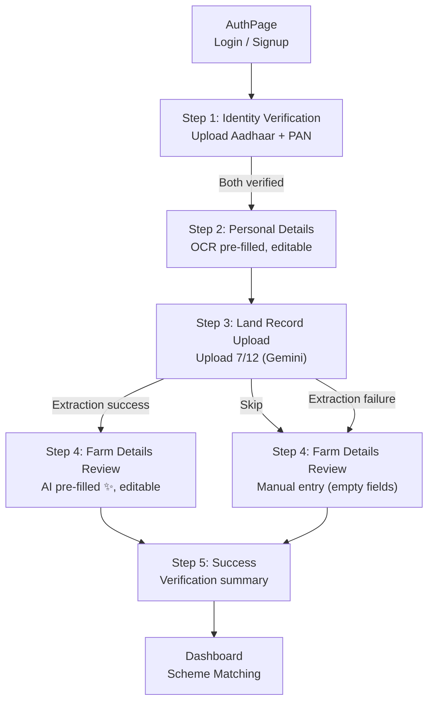

# Frontend UX Integration Plan
## Intelligent Document Processing — Onboarding Experience Design

---

## 1. How Should the Registration Flow Change?

### Current Flow (4 steps)

```
Step 1: Identity Verification     → Upload Aadhaar + PAN (OCR auto-fill)
Step 2: Personal Details          → Phone, Age, Income, State, Gender (editable)
Step 3: Farm Details              → Land size, Soil, Season, Crops (manual entry)
Step 4: Success                   → Redirect to Dashboard
```

### New Flow (5 steps)

```
Step 1: Identity Verification     → Upload Aadhaar + PAN (OCR auto-fill)        [UNCHANGED]
Step 2: Personal Details          → Phone, Age, Income, State, Gender            [UNCHANGED]
Step 3: Land Record Upload        → Upload 7/12 document (Gemini auto-fill)      [NEW]
Step 4: Farm Details Review       → All agricultural fields PRE-FILLED + editable [MODIFIED]
Step 5: Success                   → Redirect to Dashboard                        [UNCHANGED]
```

### Design Rationale

- **Step 3 is a NEW dedicated upload step.** It is NOT merged into Step 1 (identity verification) because the 7/12 document serves a fundamentally different purpose — agricultural data extraction, not identity verification.
- **Step 4 becomes a review step**, not a data-entry step. The user should be pleasantly surprised that their farm details are already filled in after uploading the 7/12.
- The separation between "upload" and "review" is critical UX. The user feels the AI did real work for them.

---

## 2. Where Should Aadhaar Upload Occur?

**Step 1 — Identity Verification.** No change.

The Aadhaar card remains the first document uploaded. It produces:
- `full_name` (auto-fills the Personal Details form)
- `gender` (auto-fills)
- `age` / `dob` (auto-fills)
- `aadhar_number` (stored, verified)

**UX Behaviour:** Immediate processing. The spinner runs while OCR processes. When complete, the card turns green with a confidence badge. The user cannot proceed to Step 2 until both Aadhaar and PAN are uploaded.

---

## 3. Where Should PAN Upload Occur?

**Step 1 — Identity Verification.** No change.

PAN upload remains alongside Aadhaar in Step 1. It produces:
- `pan_number` (stored, verified)
- `full_name` (cross-checked with Aadhaar)
- `father_name` (stored)

**UX Behaviour:** Same as Aadhaar — immediate processing, visual feedback, confidence badge.

---

## 4. Where Should 7/12 Upload Occur?

**Step 3 — Land Record Upload (NEW).** This is a dedicated step between "Personal Details" and "Farm Details Review".

### Why a Separate Step?

1. **Different engine.** Aadhaar/PAN use Tesseract OCR (fast, <2s). The 7/12 uses Gemini Vision (slower, 3-8s). Mixing them in the same step creates confusing loading states.
2. **Different purpose.** Identity verification is mandatory. 7/12 extraction is an intelligence feature — it auto-fills agricultural data that the user would otherwise type manually.
3. **Different user expectation.** The 7/12 is a complex government document. The user needs a dedicated context to understand what is happening and what data was extracted.
4. **Skippable.** Unlike Aadhaar/PAN, the 7/12 can be skipped (see Question 14).

---

## 5. Should Uploads Happen One-by-One or Together?

**One-by-one, with immediate processing.**

### Rationale

| Approach | Pros | Cons |
|---|---|---|
| One-by-one (immediate) | Instant feedback, early error detection, feels responsive | User waits briefly per document |
| Batch (all at once) | Single click | Long combined wait, no per-document feedback, confusing errors |

**Decision: One-by-one.** Each document is uploaded, processed, and validated independently. The user sees immediate results for each card before moving on. This matches the existing Aadhaar/PAN pattern and keeps the experience consistent.

---

## 6. When Should Automatic Extraction Begin?

**Immediately upon file selection.**

The user selects or drops a file → the upload starts → extraction runs server-side → the result is displayed. There is no "Submit All" button.

### State Machine

```
IDLE → FILE_SELECTED → UPLOADING → EXTRACTING → SUCCESS / ERROR
```

For the 7/12 specifically, the loading state should communicate that Gemini (AI) is analyzing the document, not simple OCR.

---

## 7. How Should Extracted Information Appear?

**After processing finishes, in two phases:**

### Phase A — Immediate Confirmation (Step 3: Upload Step)
When the 7/12 extraction completes, the upload card shows:
- ✅ Green border + confidence badge (e.g., "92%")
- A compact summary of key extracted fields:
  - Owner Name: `राजेश कुमार`
  - Survey No: `123/4`
  - Village: `कासारवाडी`
  - Land Area: `2.5 Hectare`
- A small info banner: *"12 fields extracted. Review on the next screen."*

### Phase B — Full Editable Review (Step 4: Farm Details Review)
When the user clicks "Continue to Farm Details", Step 4 loads with all agricultural fields pre-populated:
- Land Size Hectares ← from `land_area`
- Soil Type ← from `soil_type`
- Crop Season ← from `season`
- Water Source ← from `irrigation`
- Primary Crops ← from `current_crop`
- Land Ownership ← from `ownership_type`

Each field shows a small "AI-filled" indicator (a ✨ sparkle icon or subtle badge) so the user knows which values came from Gemini vs. which they entered manually.

A banner at the top reads:
> ✨ Fields pre-filled from your 7/12 land record. Please review and edit if needed.

This mirrors the existing OCR pre-fill banner that already exists in Step 2.

---

## 8. How Should Validation Warnings Be Displayed?

### Per-Document Warnings (within the upload card)
The existing pattern already works well. The amber warning banner below the upload card shows:
```
⚠️ Uploaded — Document quality is low. Some fields may need manual review.
```

### Cross-Document Conflicts (between steps)
If the `DocumentValidator` detects a conflict (e.g., Aadhaar says district is "Pune" but 7/12 says "Nashik"), the response includes `cross_document_validation`. This should be displayed as:
```
⚠️ Cross-Document Conflict: District differs between Aadhaar (Pune) and 7/12 (Nashik).
   The 7/12 value has been used. You can edit this below.
```

### Placement
- **Step 3 (upload):** Warnings appear under the upload card, same as existing Aadhaar/PAN pattern.
- **Step 4 (review):** Conflicting fields are highlighted with an amber border and a small tooltip explaining the conflict.

---

## 9. How Should Gemini Processing Be Communicated?

The 7/12 uses Gemini Vision, not Tesseract OCR. The user should perceive this as a qualitatively different, more intelligent process.

### Loading State Copy

| Current (OCR) | New (Gemini) |
|---|---|
| "Running OCR analysis…" | "🤖 AI is reading your land record…" |

### Visual Differentiation
- The Aadhaar/PAN upload cards use a standard `Loader2` spinner.
- The 7/12 upload card should use an animated "thinking" indicator — a pulsing gradient bar or a shimmer effect across the card — to communicate that something more sophisticated is happening.
- Below the spinner, show estimated time: *"This typically takes 5-10 seconds"*

### After Completion
- Toast: `✅ Land record analyzed! 12 agricultural fields extracted by AI.`
- The upload card's icon shifts from a generic upload icon to a `Sparkles` icon to reinforce the AI capability.

---

## 10. How Should Loading States Work?

### Step 1: Identity Verification (Existing — No Change)
```
Upload card: IDLE → LOADING (spinner + "Running OCR analysis…") → VERIFIED (green)
Continue button: Disabled until both cards are green
```

### Step 3: Land Record Upload (New)
```
Upload card: IDLE → LOADING (animated bar + "AI is reading your land record…") → SUCCESS (green + field summary)
Continue button: Initially shows "Skip — I'll enter manually"
                 After success, changes to "Continue to Farm Details ✨"
```

### Step 4: Farm Details Review (Modified)
```
No loading state. All fields are already populated.
If 7/12 was skipped, fields are empty and the user fills them manually (current behaviour).
If 7/12 was uploaded, fields are pre-filled with AI badges.
```

---

## 11. How Should Extraction Failures Work?

### Scenario A: Network/Server Error (500)
```
Toast: "❌ Upload failed. Please try again."
Upload card: Returns to IDLE state. File input is cleared.
User can: Re-upload the same file or a different one.
```

### Scenario B: Unsupported File Type (400)
```
Toast: "❌ Invalid file type. Please upload JPG, PNG, or PDF."
Upload card: Returns to IDLE state.
```

### Scenario C: Gemini Extraction Failure (success: false in response)
```
Toast: "⚠️ We couldn't extract data from this document. You can enter details manually."
Upload card: Shows amber state (not red) — "Upload received, but extraction was incomplete"
Continue button: Still shows "Skip — I'll enter manually" so the user can proceed.
Step 4: Agricultural fields remain empty for manual entry.
```

### Scenario D: Partial Extraction (success: true, but low confidence / missing fields)
```
Toast: "✅ Partial extraction complete — some fields may need manual review."
Upload card: Green with warnings listed
Step 4: Pre-filled fields show values. Empty fields are highlighted for user attention.
```

### Critical Design Principle
**Extraction failure must NEVER block the wizard.** The user can always skip Step 3 and enter farm details manually in Step 4. The 7/12 upload is an enhancement, not a gate.

---

## 12. How Should Users Edit Extracted Information?

### Step 4: Farm Details Review
All fields are rendered as standard editable form inputs (same as current Step 3). The user can:
1. **Accept** the pre-filled value by leaving it unchanged.
2. **Override** any value by typing in the input field.
3. **Clear** a value if the extraction was wrong.

### Visual Indicators
- Fields filled by AI: Show a subtle `✨` icon next to the label and a faint emerald background tint.
- Fields filled manually by the user: Standard styling (no indicator).
- Fields with validation warnings: Amber border + tooltip.

### No Confirmation Modal
The user does NOT need to "confirm" each field individually. That would be tedious. The entire Step 4 is the confirmation — the user reviews the form, makes edits, and clicks "Save & Finish".

---

## 13. How Should Success Messages Work?

### Per-Document Success (Toast)
```
✅ Aadhaar verified! Fields auto-filled.          (existing)
✅ PAN verified! Fields auto-filled.               (existing)
✅ Land record analyzed! 12 fields extracted by AI. (new)
```

### Step Completion Success (Visual)
- Step 1 → Step 2 transition: "Identity verified ✅" badge in the progress header.
- Step 3 → Step 4 transition: "Land record processed ✨" badge in the progress header.

### Final Save Success (Step 5: Success Screen)
The existing success screen is adequate. One enhancement:
- Add a summary card showing verification status:
  ```
  ✅ Aadhaar Verified
  ✅ PAN Verified  
  ✅ 7/12 Land Record Analyzed
  ```
- If 7/12 was skipped, show: `⏭️ 7/12 Skipped — you can upload later from your Dashboard`

---

## 14. Should Users Be Able to Skip 7/12?

**Yes. The 7/12 upload MUST be skippable.**

### Rationale
1. Not all farmers have a 7/12 document readily available during onboarding.
2. The 7/12 is specific to Maharashtra. Farmers from other states may have equivalent documents with different names.
3. The wizard should never block a farmer from completing registration.
4. Agricultural fields can always be entered manually in Step 4.
5. The user can upload the 7/12 later from the Dashboard's Document Center.

### Skip UX
- Step 3 always shows a secondary button: **"Skip — I'll enter details manually"**
- Clicking Skip navigates directly to Step 4 with empty agricultural fields.
- No warning modal. No friction. Just skip.

---

## 15. What Happens If the User Uploads Only Aadhaar?

### In Step 1
The PAN upload card remains in its IDLE state. The "Continue" button stays disabled with the label: *"Upload both documents to continue"*.

**The user cannot proceed without both Aadhaar AND PAN.** This is the existing behaviour and should NOT change. Identity verification is mandatory for eligibility matching.

### Edge Case: User Has No PAN
This is a real scenario for many rural farmers. However, the current architecture already enforces both documents. Changing this is out of scope for this integration — it is a **Category B (Post-Demo)** improvement. For now, both documents remain required in Step 1.

---

## 16. How Should the Final Review Screen Look?

### Before (Current Step 4: Success)
A large green checkmark, a "Setup Complete!" heading, and a single button: "View My Scheme Matches".

### After (New Step 5: Success + Summary)
The success screen should be enhanced with a verification summary:

```
┌──────────────────────────────────────┐
│           ✅ Setup Complete!          │
│                                      │
│  ┌──────────────────────────────┐    │
│  │  ✅ Aadhaar    Verified      │    │
│  │  ✅ PAN        Verified      │    │
│  │  ✅ 7/12       12 fields AI  │    │
│  │         — or —               │    │
│  │  ⏭️ 7/12       Skipped       │    │
│  └──────────────────────────────┘    │
│                                      │
│  Your verified farmer profile is     │
│  ready. Our AI is scanning 1,200+    │
│  government schemes tailored for you │
│                                      │
│  ┌──────────────────────────────┐    │
│  │   View My Scheme Matches →   │    │
│  └──────────────────────────────┘    │
└──────────────────────────────────────┘
```

---

## Screen Flow Diagram



---

## State Transitions

### ProfileWizard Component State

```typescript
// Current state shape
interface UploadStatus {
  loading: boolean;
  verified: boolean;
  confidence: number;
  warnings: string[];
}

// New: add 7/12 status
const [uploadStatus, setUploadStatus] = useState<Record<string, UploadStatus>>({
  aadhar: { loading: false, verified: false, confidence: 0, warnings: [] },
  pan:    { loading: false, verified: false, confidence: 0, warnings: [] },
  satbara:{ loading: false, verified: false, confidence: 0, warnings: [] },  // NEW
});

// New: store Gemini-extracted agricultural fields before merging into profile
const [satbaraFields, setSatbaraFields] = useState<Record<string, any> | null>(null);
```

### Step Transition Logic

```
Step 1 → Step 2:  GATE = aadhar.verified && pan.verified              (UNCHANGED)
Step 2 → Step 3:  GATE = none (user clicks "Next")                    (UNCHANGED)
Step 3 → Step 4:  GATE = none (user clicks "Continue" or "Skip")      (NEW)
Step 4 → Step 5:  GATE = saveDetails() API call succeeds               (UNCHANGED)
```

---

## API Interaction

### Step 1: Aadhaar Upload
```
POST /api/upload
  FormData: { file: <File>, doc_type: "aadhar" }
Response: { status, documentType, fields, validation }
  → fields.aadhaarNumber → profile.aadhar_number
  → profileSuggestions.full_name_ocr_suggestion → profile.full_name
  → profileSuggestions.gender → profile.gender
  → profileSuggestions.age → profile.age
```

### Step 1: PAN Upload
```
POST /api/upload
  FormData: { file: <File>, doc_type: "pan" }
Response: { status, documentType, fields, validation }
  → fields.panNumber → profile.pan_number
```

### Step 3: 7/12 Upload (NEW)
```
POST /api/upload
  FormData: { file: <File>, doc_type: "7_12" }
Response: { status, documentType, fields, validation, cross_document_validation? }
  → fields.owner_name.value     → display in summary card
  → fields.survey_number.value  → display in summary card
  → fields.village.value        → display in summary card
  → fields.land_area.value      → profile.land_size_hectares (after parsing)
  → fields.irrigation.value     → profile.irrigation_type
  → fields.soil_type.value      → profile.soil_type
  → fields.season.value         → profile.crop_season
  → fields.current_crop.value   → profile.primary_crops
  → fields.ownership_type.value → profile.land_ownership
  → fields.district.value       → profile.district (if empty)
```

> **IMPORTANT:** Note the response shape difference. For Aadhaar/PAN, the existing frontend reads `data.fields.aadhaarNumber` (flat string). For 7/12, the backend returns `data.fields.<name>.value` (ExtractionResult schema). The frontend mapping logic MUST account for this difference. The backend `upload.py` already returns `result_dict["fields"]` which is `{field_name: {value, source_document, confidence}}`.

### Step 4: Profile Save
```
PUT /api/farmers/me
  JSON: { ...profile, profile_wizard_complete: true }
```
No change to this API call.

---

## Component Interaction Map

```
ProfileWizard.tsx (orchestrator)
├── State: step, profile, uploadStatus, satbaraFields
├── Step 1: DocumentUploadCard × 2  (aadhar, pan)
│   └── calls: handleFileUpload("aadhar" | "pan")
│       └── POST /api/upload → auto-fill profile state
├── Step 2: Personal Details Form (editable inputs)
│   └── reads: profile state (OCR pre-filled)
├── Step 3: SatbaraUploadCard × 1  (7_12)         ← NEW
│   └── calls: handleSatbaraUpload()               ← NEW
│       └── POST /api/upload → store satbaraFields → auto-fill profile state
├── Step 4: Farm Details Review Form (editable inputs)  ← MODIFIED
│   └── reads: profile state (Gemini pre-filled or empty)
│   └── calls: saveDetails() → PUT /api/farmers/me
└── Step 5: Success Screen + Verification Summary   ← MODIFIED
```

---

## Recommended Implementation Sequence

The following order minimises risk and ensures each phase is independently testable.

### Phase 1: Backend Alignment (1 file)
**File:** [Dashboard.tsx](file:///Users/mehulsharma/Desktop/IPD/binary-brains-gamora/frontend/src/pages/Dashboard.tsx)
**Change:** Fix the `doc_type` mismatch. When `uploadType === "Land_Record"`, send `doc_type: "7_12"` instead of `"land_record"`.
**Why first:** This is a one-line fix that immediately unblocks 7/12 uploads from the Dashboard, even before the wizard is updated.
**Verify:** Upload a 7/12 from the Dashboard → backend should route to `Satbara712Processor` → toast should show success.

---

### Phase 2: Wizard Step Expansion (1 file)
**File:** [ProfileWizard.tsx](file:///Users/mehulsharma/Desktop/IPD/binary-brains-gamora/frontend/src/pages/ProfileWizard.tsx)
**Changes:**
1. Add `satbara` to the `uploadStatus` state.
2. Increment `totalSteps` from 4 to 5.
3. Update `stepLabels` and `stepIcons` arrays.
4. Insert a new Step 3 block with:
   - AI info banner (purple/blue, Gemini branding)
   - 7/12 upload card (reuse `DocumentUploadCard` pattern with `docKey="7_12"`)
   - Skip button
   - Continue button (enabled after successful extraction)
5. Renumber existing Step 3 (farm details) → Step 4.
6. Renumber existing Step 4 (success) → Step 5.
**Verify:** Walk through the wizard. Step 3 should render the 7/12 upload UI. Skip should work. Navigation should be correct.

---

### Phase 3: Gemini Extraction Handler (1 file)
**File:** [ProfileWizard.tsx](file:///Users/mehulsharma/Desktop/IPD/binary-brains-gamora/frontend/src/pages/ProfileWizard.tsx)
**Changes:**
1. Create `handleSatbaraUpload()` function that:
   - Sends `POST /api/upload` with `doc_type: "7_12"`
   - Parses `data.fields.<name>.value` from the response
   - Maps extracted fields to profile state (land_size_hectares, irrigation_type, soil_type, crop_season, primary_crops, land_ownership, district)
   - Stores extracted fields in `satbaraFields` for display in the upload summary
2. Show extracted field summary in the upload card after success.
3. Handle partial extraction and failure gracefully.
**Verify:** Upload a real 7/12 document. Fields should appear in the summary. Navigate to Step 4 — fields should be pre-filled.

---

### Phase 4: Farm Details Review Enhancement (1 file)
**File:** [ProfileWizard.tsx](file:///Users/mehulsharma/Desktop/IPD/binary-brains-gamora/frontend/src/pages/ProfileWizard.tsx)
**Changes:**
1. Add the "✨ Fields pre-filled from your 7/12 land record" banner to Step 4 (conditional on satbaraFields being non-null).
2. Add visual indicators (sparkle icons) to fields that were AI-filled.
3. All fields remain fully editable.
**Verify:** Upload 7/12 → navigate to Step 4 → see pre-filled fields with AI indicators → edit a field → save.

---

### Phase 5: Success Screen Enhancement (1 file)
**File:** [ProfileWizard.tsx](file:///Users/mehulsharma/Desktop/IPD/binary-brains-gamora/frontend/src/pages/ProfileWizard.tsx)
**Changes:**
1. Add verification summary to Step 5 (Aadhaar ✅, PAN ✅, 7/12 ✅ or ⏭️).
2. Display count of AI-extracted fields if 7/12 was uploaded.
**Verify:** Complete the full wizard → success screen shows correct verification badges.

---

### Phase 6: Dashboard Upload Integration (1 file)
**File:** [Dashboard.tsx](file:///Users/mehulsharma/Desktop/IPD/binary-brains-gamora/frontend/src/pages/Dashboard.tsx)
**Changes:**
1. After a successful 7/12 upload from the Dashboard Document Center, parse the Gemini response fields and update the profile form state.
2. Show an "AI fields updated" toast with the count of extracted fields.
3. Display `is_7_12_verified` status in the KYC status section.
**Verify:** Upload a 7/12 from Dashboard → profile tab should show updated agricultural fields.

---

### Phase 7: i18n Strings (3 files)
**Files:** `en.json`, `hi.json`, `gu.json`
**Changes:** Add translation keys for all new UI strings:
- `wizard.step_land_record`
- `wizard.ai_reading_land_record`
- `wizard.skip_manual_entry`
- `wizard.fields_extracted`
- `wizard.prefilled_from_712`
- etc.
**Verify:** Switch languages → all new strings should render correctly.

---

## Summary

| Question | Decision |
|---|---|
| Registration flow change | 4 steps → 5 steps (new Step 3: Land Record Upload) |
| Aadhaar upload location | Step 1 — unchanged |
| PAN upload location | Step 1 — unchanged |
| 7/12 upload location | Step 3 — new dedicated step |
| Upload approach | One-by-one, immediate processing |
| Extraction timing | Immediately upon file selection |
| Results display | Summary on upload card + full review on next step |
| Validation warnings | Amber banners (per-doc) + amber borders (cross-doc conflicts) |
| Gemini communication | "AI is reading your land record…" + animated bar |
| Loading states | Spinner (OCR) vs animated bar (Gemini) |
| Failure handling | Toast + graceful degradation to manual entry |
| Editing extracted data | All fields editable in Step 4 review |
| Success messages | Per-document toasts + verification summary on success screen |
| Skip 7/12? | Yes — always skippable |
| Only Aadhaar uploaded? | PAN still required; cannot proceed without both |
| Final review screen | Enhanced with verification badges for all 3 document types |

**Total files modified: 4** (ProfileWizard.tsx, Dashboard.tsx, en.json, hi.json, gu.json)
**Total files created: 0**
**Backend changes: 0**
