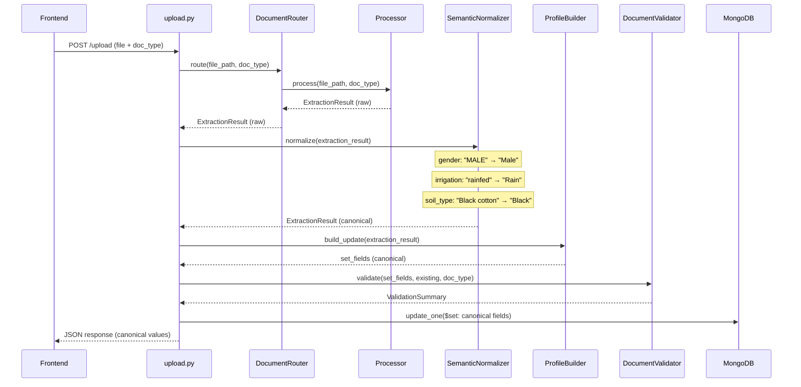

# Semantic Normalization Architecture

## Intelligent Document Processing Engine — Canonical Value Resolution

**Project:** AgriSense — Intelligent Scheme Discovery Platform
**Date:** 2026-08-06
**Status:** Design document. Not yet implemented.

---

## Problem Statement

The Intelligent Document Processing Engine successfully extracts structured data from documents via OCR (Aadhaar, PAN) and Gemini Vision (7/12 Satbara). However, the extracted values are expressed in whatever form the source document or AI model produces — uppercase strings, free-text descriptions, Marathi script, mixed-case abbreviations.

The frontend and database expect **canonical enum values** (e.g. `"Male"`, `"Well"`, `"Kharif"`, `"Black"`). There is currently no layer that bridges extracted values to canonical values.

### Examples of the Mismatch

| Source | Extracted Value | Expected Canonical | Field |
|---|---|---|---|
| Aadhaar OCR | `"MALE"` | `"Male"` | gender |
| Gemini 7/12 | `"Well irrigation"` | `"Well"` | irrigation_type |
| Gemini 7/12 | `"Black cotton soil"` | `"Black"` | soil_type |
| Gemini 7/12 | `"rainfed"` | `"Rain"` | irrigation_type |
| Gemini 7/12 | `"kharif"` | `"Kharif"` | crop_season |
| Gemini 7/12 | `"खरीप"` | `"Kharif"` | crop_season |
| Gemini 7/12 | `"joint"` | `"Shared"` | land_ownership |
| Gemini 7/12 | `"individual"` | `"Owned"` | land_ownership |
| Gemini 7/12 | `"6 हेक्टर 11 आर"` | `"6.11"` | land_area (numeric) |

---

## Current Pipeline

```
upload.py:107    DocumentRouter.route(file_path, doc_type)
                      │
                      ▼
                 ┌──────────┐
                 │ Processor │  (AadhaarProcessor / PANProcessor / Satbara712Processor)
                 └──────────┘
                      │
                      ▼
              ExtractionResult          ← fields contain raw extracted values
                      │
upload.py:122    ProfileBuilder.build_update(extraction_result)
                      │
                      ▼
              set_fields (dict)         ← still raw values, mapped to DB column names
                      │
upload.py:129    DocumentValidator.validate(set_fields, existing_farmer, doc_type)
                      │
                      ▼
              ValidationSummary         ← cross-document conflict detection
                      │
upload.py:140    MongoDB update
                      │
upload.py:152    HTTP response → frontend
```

**The gap:** Between `Processor → ProfileBuilder`, no transformation converts raw extracted strings into canonical enum values.

---

## Question 1: Should Normalization Happen Before or After Validation?

### Answer: BEFORE validation. Specifically, between the Processor output and the ProfileBuilder input.

### Reasoning

1. **Cross-document validation compares values.** The `DocumentValidator` (line 104) compares `existing_name.lower()` to `incoming_name.lower()`. If one document produced `"MEHUL SHARMA"` and another produced `"Mehul Sharma"`, the current `.lower()` comparison works. But for enum fields like gender, if one extraction wrote `"MALE"` and another wrote `"Male"`, the validator needs both to be in canonical form to detect actual conflicts vs. formatting differences.

2. **ProfileBuilder writes directly to MongoDB.** The `FarmerProfileBuilder.build_update()` produces the `$set` dict that goes straight into the database. If normalization runs after the ProfileBuilder, the DB receives raw values. All downstream consumers (scheme matching engine, frontend profile display, analytics) would need their own normalization — violating DRY.

3. **Validation should operate on clean data.** A soil type of `"Black cotton soil"` vs `"Black"` is not a conflict — it is the same value expressed differently. Without prior normalization, the validator would flag a false conflict if a second document also mentions soil type.

### Insertion point in the pipeline

```
Processor
    │
    ▼
ExtractionResult  (raw values)
    │
    ▼
┌────────────────────┐
│ SemanticNormalizer  │  ◄── NEW
└────────────────────┘
    │
    ▼
ExtractionResult  (canonical values, confidence adjusted)
    │
    ▼
ProfileBuilder
    │
    ▼
DocumentValidator
    │
    ▼
MongoDB
```

---

## Question 2: Should Normalization Live Inside Each Processor or in a Shared Service?

### Answer: Shared service. A single `SemanticNormalizer` class in the `document_processing` package.

### Reasoning

1. **Processors should not know about the frontend's enum vocabulary.** The `AadhaarProcessor` extracts `"MALE"` because that is what Tesseract reads from the card. The processor is correct — its job is accurate extraction. Knowing that the UI displays `"Male"` is a presentation-layer concern that should not leak into the extraction layer.

2. **Normalization rules are cross-cutting.** The `gender` field can come from Aadhaar OCR, PAN OCR, or potentially future processors (voter ID, driving licence). Each processor should not independently implement gender normalization.

3. **Testability.** A dedicated normalizer can be unit-tested with a table of `(raw_input, expected_canonical)` pairs without needing to instantiate any processor or call any API.

4. **Extensibility.** Adding a new document type (e.g. Income Certificate, Soil Health Card) should not require reimplementing normalization for fields that are already covered.

### Architecture

```python
# Conceptual interface — not the final implementation
class SemanticNormalizer:
    def normalize(self, result: ExtractionResult) -> ExtractionResult:
        """Normalize all field values in-place to canonical enums."""
```

The normalizer mutates or replaces field values on the `ExtractionResult` before it reaches the `ProfileBuilder`. Each field is dispatched to a field-specific normalization function.

---

## Question 3: Should Gemini Prompts Be Changed to Return Canonical Values?

### Answer: Yes, selectively — for enum-constrained fields only. Free-text fields must remain unconstrained.

### Fields to Constrain in the Prompt

| Field | Current Prompt Guidance | Recommended Change |
|---|---|---|
| `irrigation` | `"e.g. 'well', 'canal', 'rainfed'"` | `"Must be one of: Well, Canal, Rain, River, Borewell, None"` |
| `soil_type` | `"soil type if mentioned, null if not present"` | `"Must be one of: Alluvial, Black, Red, Laterite, Desert, Mountain, null"` |
| `ownership_type` | `"e.g. 'individual', 'joint', 'inherited'"` | `"Must be one of: Owned, Leased, Shared"` |
| `season` (in additional_info) | `"kharif/rabi/both"` | `"Must be one of: Kharif, Rabi, Zaid, Both, null"` |

### Fields to Keep Free-Text

| Field | Reason |
|---|---|
| `owner_name` | Proper noun — cannot be enumerated |
| `village`, `taluka`, `district` | Geographic names — cannot be enumerated |
| `survey_number`, `gat_number` | Numeric identifiers — cannot be enumerated |
| `land_area` | Numeric with mixed units — requires numeric parsing, not enum matching |
| `current_crop` | Open vocabulary — thousands of possible crops |
| `co_owners` | Name list — cannot be enumerated |

### Why Both Prompt Constraints AND Backend Normalization

Prompt constraints are a **best-effort optimisation.** They reduce the normalizer's workload by 80%+ because Gemini will usually comply. But:

- LLMs are non-deterministic. Gemini may still return `"well"` instead of `"Well"` on occasion.
- Multilingual documents may cause Gemini to respond in Marathi despite English instructions.
- The normalizer must remain the authoritative safety net.

**Strategy: Prompt for canonical values. Normalize as the safety net.**

---

## Question 4: Should OCR Outputs Pass Through the Same Normalizer?

### Answer: Yes. Every `ExtractionResult` passes through the same `SemanticNormalizer`, regardless of source.

### Reasoning

1. **Gender normalization is needed for Aadhaar.** OCR returns `"MALE"` / `"FEMALE"`. The frontend needs `"Male"` / `"Female"`. This is currently the highest-severity bug.

2. **Uniform data quality.** The scheme matching engine queries `gender == "Male"`, not `gender == "MALE"`. If OCR bypasses normalization, the scheme matcher must handle both forms — an unnecessary complexity.

3. **No-op for already-canonical values.** Normalizing `"ABCDE1234F"` (PAN number) is a no-op. The normalizer only transforms fields it has rules for. Fields without normalization rules pass through untouched.

### OCR fields that need normalization

| Field | Source | Current Output | Canonical |
|---|---|---|---|
| `gender` | Aadhaar | `"MALE"` / `"FEMALE"` / `"TRANSGENDER"` | `"Male"` / `"Female"` / `"Other"` |

### OCR fields that do NOT need normalization

| Field | Reason |
|---|---|
| `aadhar_number` | Format is standardised (12 digits) |
| `pan_number` | Format is standardised (AAAAA9999A) |
| `full_name` | Proper noun — title-casing could be applied but is not an enum concern |
| `dob` | Date format (already validated by the OCR validator) |

---

## Question 5: How Should Multilingual Values Be Handled?

### Answer: Field-specific synonym tables that include Devanagari, English variants, abbreviations, and common misspellings.

### Example: `crop_season` normalization table

```python
SEASON_SYNONYMS = {
    "Kharif": [
        "kharif", "KHARIF", "Kharif", "kharip",
        "खरीप", "खरीफ", "खरिफ",
        "monsoon", "rainy season",
    ],
    "Rabi": [
        "rabi", "RABI", "Rabi", "rabbi",
        "रबी", "रब्बी",
        "winter crop", "winter season",
    ],
    "Zaid": [
        "zaid", "ZAID", "Zaid", "zayad",
        "जायद", "उन्हाळी",
        "summer crop", "summer season",
    ],
}
```

### Resolution algorithm

```
normalize_enum(raw_value, synonym_table) → canonical_key | None

1. Exact match: If raw_value equals any key → return that key.
2. Case-insensitive match: lowercase(raw_value) in lowercase(synonyms) → return key.
3. Contains match: If any synonym is contained in raw_value → return key.
   Example: "Well irrigation" contains "Well" → "Well".
4. Devanagari match: If raw_value matches any Devanagari synonym → return key.
5. Fuzzy match (optional, conservative): Levenshtein distance ≤ 2 → return key
   with reduced confidence.
6. No match: Return None. The raw value is preserved but marked as "unresolved".
```

### Priority order

Exact > Case-insensitive > Contains > Devanagari > Fuzzy

Higher-priority matches preserve confidence. Lower-priority matches (fuzzy) reduce confidence.

---

## Question 6: How Should Enum Values Be Normalized?

### Answer: Each normalizable field gets a dedicated synonym table. Normalization is a pure function: `(raw_value, field_name) → canonical_value`.

### Complete enum tables required

```
GENDER_MAP:
    "Male"   ← ["MALE", "male", "M", "पुरुष"]
    "Female" ← ["FEMALE", "female", "F", "महिला", "स्त्री"]
    "Other"  ← ["TRANSGENDER", "transgender", "T", "तृतीयपंथी", "Other"]

IRRIGATION_MAP:
    "Well"     ← ["well", "Well irrigation", "open well", "tube well", "tubewell", "विहीर"]
    "Canal"    ← ["canal", "Canal irrigation", "कालवा"]
    "Rain"     ← ["rain", "rainfed", "rain-fed", "Rain-fed agriculture", "जिरायत", "कोरडवाहू"]
    "River"    ← ["river", "River irrigation", "नदी"]
    "Borewell" ← ["borewell", "bore well", "Bore Well", "बोअरवेल"]

SOIL_TYPE_MAP:
    "Alluvial"  ← ["alluvial", "Alluvial soil", "गाळाची माती"]
    "Black"     ← ["black", "Black cotton soil", "black soil", "काळी माती", "काळी कापूस माती", "regur"]
    "Red"       ← ["red", "Red soil", "red laterite", "तांबडी माती", "लाल माती"]
    "Laterite"  ← ["laterite", "Laterite soil", "जांभी माती", "jambhi"]
    "Desert"    ← ["desert", "Desert soil", "sandy", "वाळवंटी माती"]
    "Mountain"  ← ["mountain", "Mountain soil", "hill soil", "डोंगरी माती"]

SEASON_MAP:
    (as shown in Question 5)

OWNERSHIP_MAP:
    "Owned"  ← ["owned", "individual", "Individual", "स्वतःची", "self", "personal"]
    "Leased" ← ["leased", "lease", "Leased", "भाडेपट्टी", "rent"]
    "Shared" ← ["shared", "joint", "Joint", "संयुक्त", "co-owned", "inherited"]
```

---

## Question 7: How Should Confidence Scores Behave After Normalization?

### Answer: Confidence should decrease for fuzzy or heuristic matches. It should remain unchanged for exact or case-insensitive matches. It should never increase.

### Confidence adjustment rules

| Match Type | Confidence Multiplier | Rationale |
|---|---|---|
| Exact match | `1.0` (unchanged) | The value is unambiguously the canonical form |
| Case-insensitive match | `1.0` (unchanged) | `"kharif"` → `"Kharif"` is deterministic |
| Contains match | `0.95` | `"Well irrigation"` → `"Well"` is highly likely but not guaranteed |
| Devanagari synonym match | `0.90` | Translation adds slight uncertainty |
| Fuzzy match (Levenshtein ≤ 2) | `0.75` | Significant uncertainty — may be a false match |
| No match (unresolved) | Unchanged | Value passes through as-is; consumer must handle |

### Implementation

```python
def normalize_field(field: ExtractedField, field_name: str) -> ExtractedField:
    canonical, match_type = resolve_canonical(field.value, field_name)
    if canonical is not None:
        field.value = canonical
        field.confidence *= CONFIDENCE_MULTIPLIERS[match_type]
    return field
```

---

## Question 8: Should Normalization Occur Before ProfileBuilder?

### Answer: Yes. This is the most critical architectural decision in this document.

### Reasoning

The `FarmerProfileBuilder` writes field values directly to MongoDB via `$set`:

```python
# profile_builder.py:104
set_fields[db_key] = ext_field.value
```

If normalization runs after the ProfileBuilder, the database receives raw values. The consequences cascade:

1. **Scheme matching breaks.** The `ranking_engine` queries like `gender == "Male"`. If the DB stores `"MALE"`, the farmer is excluded from gender-specific schemes.

2. **Frontend re-normalizes.** The wizard reads from `/farmers/me`. If the DB stores `"rainfed"`, the frontend must normalize again to display in the dropdown. This duplicates logic and creates drift risk.

3. **Analytics and reporting break.** Aggregation queries (`db.farmers.aggregate({$group: {_id: "$soil_type"}})`) would produce separate buckets for `"Black"` and `"Black cotton soil"` — identical values appearing as different categories.

4. **Cross-document validation improves.** If normalization runs first, the `DocumentValidator` compares canonical `"Male"` vs `"Male"` instead of `"MALE"` vs `"Male"`, eliminating false conflict reports.

### Updated pipeline

```
upload.py:107    DocumentRouter.route(file_path, doc_type)
                      │
                      ▼
              ExtractionResult  (raw values)
                      │
                      ▼
                ┌──────────────────────┐
upload.py:NEW   │  SemanticNormalizer   │   normalize(extraction_result)
                └──────────────────────┘
                      │
                      ▼
              ExtractionResult  (canonical values)
                      │
                      ▼
upload.py:122    ProfileBuilder.build_update(extraction_result)
                      │
                      ▼
              set_fields (canonical values → MongoDB)
                      │
                      ▼
upload.py:129    DocumentValidator.validate(...)
                      │
                      ▼
upload.py:140    MongoDB update
                      │
upload.py:152    HTTP response (canonical values → frontend)
```

---

## Question 9: Should Normalization Be Generic Enough for Future Document Types?

### Answer: Yes. The architecture must be document-type-agnostic.

### Current document types

| Type | Processor | Fields requiring normalization |
|---|---|---|
| `aadhar` | AadhaarProcessor | `gender` |
| `pan` | PANProcessor | (none currently) |
| `7_12` | Satbara712Processor | `irrigation`, `soil_type`, `season`, `ownership_type` |

### Future document types (planned)

| Type | Anticipated normalizable fields |
|---|---|
| Income Certificate | `income_range`, `occupation_type` |
| Soil Health Card | `soil_type` (same enum!), `nutrient_levels` |
| Caste Certificate | `category` (SC/ST/OBC/General) |
| Land Mutation Records | `ownership_type` (same enum!), `mutation_type` |
| Bank Passbook | `bank_name`, `account_type` |

### Design principle

The normalizer should not contain document-type-specific logic. It normalizes **fields**, not **documents**. A `soil_type` field has the same canonical vocabulary whether it comes from a 7/12 extract, a Soil Health Card, or a future agriculture department certificate.

### Implementation pattern

```python
# Normalizer dispatches by field name, not by document type
FIELD_NORMALIZERS = {
    "gender":         normalize_gender,
    "irrigation":     normalize_irrigation,
    "soil_type":      normalize_soil_type,
    "season":         normalize_season,
    "ownership_type": normalize_ownership,
    # Future:
    # "category":     normalize_category,
    # "occupation":   normalize_occupation,
}
```

When a new document type is added, if it produces a field already in `FIELD_NORMALIZERS`, normalization works automatically. If it produces a new enum-type field, adding one entry to the table is sufficient.

---

## Question 10: Can the FarmerProfileBuilder Become Simpler After Introducing Normalization?

### Answer: Yes. The ProfileBuilder can remove all implicit value cleaning and focus exclusively on field mapping.

### Current hidden responsibilities in ProfileBuilder

Currently, `ProfileBuilder.build_update()` does:
1. Field mapping: `(doc_type, extracted_field) → db_column` ← **core responsibility**
2. Null filtering: skip `None` values ← **core responsibility**
3. Verification flag setting ← **core responsibility**
4. (Implicitly) trusts that values are clean ← **becomes explicit with normalizer**

After normalization, the ProfileBuilder:
- **Keeps:** field mapping, null filtering, verification flags
- **Loses:** nothing it currently does explicitly, but gains the guarantee that all values are canonical
- **Benefit:** No future temptation to add ad-hoc value cleaning inside the builder

### Frontend simplification

The frontend `mapExtractionToProfile()` currently would need to implement its own normalization to bridge Gemini free-text to Select options. With backend normalization, the API response already contains canonical values. The frontend mapper becomes a pure field-name translator with no value transformation — significantly simpler and less error-prone.

---

## Recommended Architecture — Final Design

### Component: `SemanticNormalizer`

```
Location:  backend/app/document_processing/normalizer.py

Role:      Transform raw extracted field values into canonical enum values
           using deterministic synonym tables.

Input:     ExtractionResult (with raw values)
Output:    ExtractionResult (with canonical values, adjusted confidence)

Depends on: schemas.py (ExtractionResult, ExtractedField)
Used by:    upload.py (inserted between router.route() and ProfileBuilder)
```

### Data Flow — Complete Sequence



### File Structure

```
backend/app/document_processing/
├── __init__.py
├── interfaces.py            ← unchanged
├── schemas.py               ← unchanged
├── router.py                ← unchanged
├── normalizer.py            ← NEW
├── profile_builder.py       ← unchanged (benefits from clean input)
├── validator.py             ← unchanged (benefits from canonical comparisons)
├── ocr/
│   ├── aadhaar.py           ← unchanged
│   └── pan.py               ← unchanged
└── vision/
    ├── gemini_pipeline.py   ← unchanged
    └── prompts.py           ← MODIFIED (add enum constraints)
```

---

## Implementation Plan

### Phase 1 — Normalizer Core (backend)

**New file:** `backend/app/document_processing/normalizer.py`

Contents:
- Synonym tables for `gender`, `irrigation`, `soil_type`, `season`, `ownership_type`
- `resolve_canonical(raw_value, field_name)` — returns `(canonical, match_type)` or `(None, None)`
- `normalize(result: ExtractionResult) → ExtractionResult` — iterates all fields, applies normalization
- Confidence adjustment logic

**Risk:** Low. New file, no existing code modified.

---

### Phase 2 — Pipeline Integration (backend)

**Modified file:** `backend/app/api/upload.py`

Change: Insert `SemanticNormalizer().normalize(extraction_result)` between line 107 (router.route) and line 122 (ProfileBuilder.build_update).

Exactly 3 lines added:
```python
from app.document_processing.normalizer import SemanticNormalizer
normalizer = SemanticNormalizer()
extraction_result = normalizer.normalize(extraction_result)
```

**Risk:** Minimal. Single insertion point. Existing logic untouched.

---

### Phase 3 — Prompt Enhancement (backend)

**Modified file:** `backend/app/document_processing/vision/prompts.py`

Change: Add enum constraints to `irrigation`, `soil_type`, `ownership_type`, and `season` fields in the extraction prompt. Free-text fields remain unconstrained.

**Risk:** Medium. Prompt changes could affect extraction quality. Must re-test with sample 7/12 documents after modification.

---

### Phase 4 — Frontend Cleanup (frontend)

**Modified file:** `frontend/src/pages/ProfileWizard.tsx`

Changes:
- Remove any frontend normalization logic (since backend now returns canonical values)
- Fix the `dob` → `age` derivation (separate from normalization, but part of the same fix batch)
- Fix the confidence calculation (`* 100` multiplier bug)
- Update the PAN branch in `mapExtractionToProfile` to also read `full_name` as fallback

**Risk:** Low. Frontend simplification, not addition of complexity.

---

### Phase 5 — Unit Tests (backend)

**New file:** `backend/tests/test_normalizer.py`

Test each synonym table with representative inputs including:
- English canonical
- English lowercase
- English uppercase
- English verbose (e.g. "Well irrigation")
- Devanagari
- Null / empty string
- Unknown value (should pass through unchanged)

---

## Benefits

1. **Single source of truth.** Canonical vocabularies are defined once in the normalizer. Neither the frontend, the ProfileBuilder, the scheme matcher, nor analytics need to independently handle variant spellings.

2. **Correct scheme matching.** The ranking engine can query `gender == "Male"` without worrying about case variants in the database.

3. **Correct frontend rendering.** React Select components receive values that match their option lists. No more blank dropdowns.

4. **Multilingual robustness.** Marathi-language 7/12 documents produce the same canonical values as English-language ones.

5. **Extensibility.** Adding a new document type or a new enum field requires only adding entries to the synonym tables — no structural changes.

6. **Auditability.** The normalizer logs every transformation it applies, creating a traceable record of what changed and why.

## Risks

1. **Over-normalisation.** A contains-match on `"Well"` could false-positive on a village name like `"Wellford"`. Mitigation: normalization is field-specific, not global.

2. **Synonym table incompleteness.** Marathi has many regional dialect variations. Some values will slip through on day one. Mitigation: unmatched values pass through unchanged and are logged, allowing iterative table expansion.

3. **Prompt change regression.** Constraining Gemini's output to enums may reduce its ability to extract uncommon values. Mitigation: only enum fields are constrained. Free-text fields remain unconstrained. Re-run PoC validation after prompt changes.

---

## Files Summary

| File | Action | Reason |
|---|---|---|
| `document_processing/normalizer.py` | **NEW** | Core normalization service |
| `api/upload.py` | **MODIFY** (3 lines) | Insert normalizer call into pipeline |
| `document_processing/vision/prompts.py` | **MODIFY** | Add enum constraints to 4 fields |
| `frontend/src/pages/ProfileWizard.tsx` | **MODIFY** | Fix dob→age, confidence bug, PAN fallback |
| `tests/test_normalizer.py` | **NEW** | Unit tests for synonym tables |
| `document_processing/schemas.py` | **UNCHANGED** | Already supports the workflow |
| `document_processing/router.py` | **UNCHANGED** | Not involved in normalization |
| `document_processing/profile_builder.py` | **UNCHANGED** | Benefits from clean input |
| `document_processing/validator.py` | **UNCHANGED** | Benefits from canonical comparisons |
| `document_processing/interfaces.py` | **UNCHANGED** | No protocol change needed |
| `document_processing/ocr/aadhaar.py` | **UNCHANGED** | Normalization is external |
| `document_processing/ocr/pan.py` | **UNCHANGED** | Normalization is external |
| `document_processing/vision/gemini_pipeline.py` | **UNCHANGED** | Normalization is external |

---

> **Design complete. Awaiting approval before implementation.**
